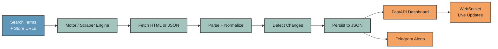
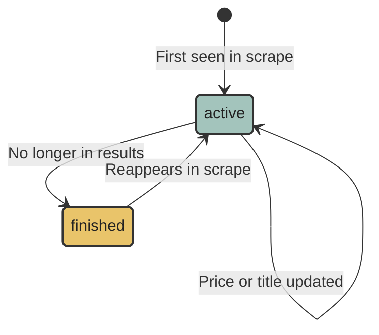

I built this thing to stop losing money. The idea was simple enough: track a few products across a couple of stores, get notified when something drops in price. Then I blinked and it was monitoring hundreds of items across four platforms, pushing Telegram alerts for any drop over 14%, and streaming live updates to a browser dashboard. This post is the architecture tour I wish I'd had before I started.

---

## The problem with manual tracking

If you've ever tried to catch a good deal on Amazon.com.mx or Mercado Libre, you already know the issue. Prices shift throughout the day. A listing that was MXN $450 in the morning might jump to $680 by evening, or disappear entirely. Manually refreshing pages doesn't scale beyond two or three products, and it certainly doesn't give you history.

What I needed was a system that fetches data automatically, remembers what it saw before, and tells me when something worth acting on happens. The piece that's easy to underestimate is the "remembers what it saw before" part. Without that, you can't detect changes, you can't compute price drops, and you can't tell the difference between a new listing and one that's been there for weeks.

---

## System overview

The whole system follows a single pipeline. Each provider fetches its pages, the results get normalized into a shared data model, that model is persisted to disk, and then two output channels do their job: a FastAPI web server serves a live dashboard, and a Telegram bot fires alerts when something meaningful happens.



Each store has its own adapter (what I call a "motor"), but they all share the same base class and lifecycle. Add a new store, implement one method, and the rest of the system handles it automatically. That composability is what made this project actually maintainable as it grew.

---

## The Motor base class

Every scraper in this project extends `Motor`, an abstract base class that handles all the plumbing so the individual adapters only have to worry about one thing: parsing a page.

The base class owns the HTTP session, the retry logic with exponential backoff, pagination, state management, and file persistence. The subclass only implements `scrape_page(body)`, which receives the raw HTML and a URL, and returns a list of extracted items plus the next page URL if one exists.

```python
class Motor(ABC):
    @abstractmethod
    def scrape_page(self, body: dict) -> Tuple[List[Any], Optional[str]]:
        """Must return a list of items and the URL for the next page (or None)."""
        pass
```

This is the Template Method pattern applied to web scraping. The algorithm stays fixed in `Motor.scrape()`: fetch the page, call `scrape_page`, process the results, follow pagination, save state. What changes per provider is only the parsing logic inside `scrape_page`. Adding Liverpool support meant writing about 40 lines of JSON parsing. The retry logic, file writes, and change detection came free.

---

## Data modeling

Getting the data model right was the most important design decision. Current prices are almost useless without context. What matters is _change_ over time.

### The Article dataclass

Every tracked product is an `Article`. The core fields are `identifier`, `title`, `price`, `url`, `status`, and `datetime`. But the part that earns its keep is `history`, a list of `ArticleHistory` entries that records every change.

```python
@dataclass
class Article:
    search_term: str
    identifier: str
    title: str
    price: float
    url: Optional[str] = None
    datetime: str = field(default_factory=lambda: str(datetime_lib.now()))
    status: Status = Status.none
    history: List[ArticleHistory] = field(default_factory=list)
    last_updated: Optional[str] = None
```

The `identifier` is the stable key. For Amazon, it's the ASIN. For Mercado Libre, it's the MLM ID. As long as that stays the same across scrapes, the system can correctly match a newly scraped item to its historical record and detect whether the price changed.

The `update()` method on `Article` compares incoming data to the current state. If something changed, it creates a new `ArticleHistory` entry and prepends it to the list. The dashboard and the Telegram alert logic both read from `history[0]` to get the previous value.

### Article status lifecycle

An article moves through states as the scraper runs. A listing that appears in results is `active`. One that was active before but no longer appears in the latest scrape gets moved to `finished`. The `Stream` class manages these collections and handles the transitions.



---

## Async scraping and concurrency

Scraping is I/O-bound work. You spend most of the time waiting for a server to respond, not doing computation. That makes it a perfect fit for `asyncio`.

The `Scrapper` class launches all motors concurrently using `asyncio.gather`. While one motor is waiting for Amazon's response, another is parsing a Mercado Libre page, and a third is writing its results to disk. On a typical cycle with five motors active, this cuts total runtime from a sequential sum to roughly the time of the slowest single provider.

```python
tasks = [
    motor.scrape(caller=self._broadcast, silent=True)
    for motor in self.motors
]
await asyncio.gather(*tasks)
```

Inside each `Motor`, the `_fetch` method uses `aiohttp` with a shared `ClientSession` and a timeout of 45 seconds. Failed requests retry up to three times with exponential backoff (0.5s, then 1s, then 2s). The header rotation in `utils/headers.py` picks a random browser profile per session to reduce fingerprinting.

---

## Provider adapters

Each platform has its own parsing strategy. They share the base class but differ significantly in how they expose data.

### Mercado Libre

Mercado Libre's search results come as standard HTML. `BeautifulSoup` finds the result container (`ui-search-results`), iterates over the list items, and extracts the title, price, and URL from specific CSS classes. Pagination comes from a `andes-pagination__link` anchor with a "Siguiente" title attribute.

The trickiest part is building clean product URLs. Raw listing URLs contain tracking parameters and redirects. The adapter extracts the MLM identifier using a regex and reconstructs a canonical URL, either as an `articulo.mercadolibre.com.mx` link or a catalog URL depending on the ID prefix.

### Amazon

Amazon returns HTML too, but the structure is more defensive. Result cards use `data-component-type="s-search-result"` as the reliable selector, and the ASIN sits in the `data-asin` attribute on the container element. Price lives in `span.a-price span.a-offscreen`, stripped of currency symbols and commas before conversion to float. Any item without a price gets skipped entirely.

### Liverpool

Liverpool is built on Next.js, and all the product data is embedded as JSON inside a `<script id="__NEXT_DATA__">` tag. No HTML parsing needed. The motor reads that JSON blob directly, pulls from `query.data.mainContent.records`, and maps each record's `allMeta` object to the normalized item structure. Page count comes from the same JSON.

### Palacio de Hierro

This one is the most complex. The frontend uses a Constructor.io search API internally. The motor loads the initial HTML page only to extract an API key and configuration from embedded `data-*` attributes. It then calls the Constructor REST endpoint directly to get structured JSON results, bypassing the need to parse the rendered HTML grid entirely.

---

## Parsing techniques and selector design

The biggest reliability lesson from this project is to target stable structural attributes over visual ones. CSS classes that look like `a-price-whole` or `ui-search-price__second-line` are presentation details. They change when the site redesigns. Attributes like `data-asin`, `data-component-type`, and element IDs baked into app state are functional. They tend to be more stable.

For Mercado Libre, the fallback chain looks like this: try the standard pagination anchor class first, then fall back to looking for a `next` button wrapper if the first selector misses. This makes the parser survive minor HTML reshuffles.

For Amazon, skipping items without prices is deliberate. Sponsored listings and ads sometimes appear in the result set with incomplete data. Rather than crashing or storing a zero-price record, the adapter silently discards them.

Defensive practices that paid off:

- Always check for `None` before calling `.get_text()` on a tag.
- Use `re.sub(r'[^\d.]', '', raw_price.replace(',', ''))` for price strings that mix currency symbols, commas, and whitespace.
- Wrap every item-level parse in a `try/except` so one broken listing doesn't abort the whole page.

---

## State management and persistence

The system stores all state in JSON files, one per motor, in a `./data/` directory. Each file is a flat array of serialized `Article` objects. When the motor starts, it loads from this file to restore the full history from previous runs. When a scrape cycle completes, it writes the updated state back.

The file write is async via `asyncio.get_running_loop().run_in_executor()`, which offloads the blocking file operation to a thread pool without blocking the event loop. On a small dataset this barely matters, but it's the correct pattern.

Change detection works like this: after fetching all items for a search term, the motor compares the new result set to the articles currently in the `active` stream. Any article that was active before but isn't in the new results gets moved to `finished`. Any article in the new results that wasn't tracked before gets added as `active` and flagged as new. Articles that appear in both get an `update()` call that checks whether the title or price changed.

---

## Real-time backend with FastAPI and WebSockets

The FastAPI application runs a background scraping loop alongside the web server using a lifespan context manager. When the app starts, it creates an async task for `Scrapper.run()`, which cycles every 400 seconds. When it shuts down, the task gets cancelled.

```python
@asynccontextmanager
async def lifespan(app: FastAPI):
    scraping_task = asyncio_create_task(scrapper.run())
    yield
    scraping_task.cancel()
```

There are two public endpoints. `GET /api/search` returns the full current snapshot: all active articles per motor, ready for the frontend to render. `WebSocket /ws/` is the live channel. Any time a scrape cycle finishes, or a new item appears, or a price drops, the server pushes a JSON message to every connected client.

The `ConnectionManager` maintains a list of active WebSocket connections and broadcasts to all of them. If a client disconnects mid-broadcast, the exception gets caught silently and that connection is removed from the list.

---

## Telegram integration

Telegram notifications run as a side effect of the broadcast pipeline. When a new article is detected, `send_new_to_telegram` formats a message with the product title, price, and URL, then sends it to a configured chat ID via the Bot API. When an update is detected, `send_price_drop_to_telegram` only fires if the price dropped by 14% or more.

The 14% threshold was chosen empirically. Below that, the noise-to-signal ratio was too high. The calculation is straightforward:

```python
percent_change = ((new_value - last_value) / abs(last_value)) * 100
if percent_change <= -14:
    send_price_drop_to_telegram(element)
```

Messages use Telegram's HTML parse mode, which means you can include `<b>` bold tags, `<a>` links, and `<s>` strikethrough for the old price. The alert format shows the old price with strikethrough, the new price in bold, the savings amount, and the percentage. It reads clearly in a notification preview without opening the chat.

---

## Reliability and resilience

Scraping fails constantly in practice, and the system has to treat that as normal, not exceptional.

At the network level, every fetch retries up to three times with exponential backoff. Status codes like 403 or 500 get logged and the item is skipped, but they don't crash the motor. Each motor runs in its own async task inside `asyncio.gather`, so one provider timing out doesn't block the others.

At the parsing level, every item is wrapped in `try/except`. A malformed price, a missing tag, or a structural change in the site's HTML will fail that item silently and move on to the next. The motor logs the error if debug mode is on, but it doesn't surface to the user.

The `ConnectionManager.broadcast` method also wraps each send in a try/except. A disconnected WebSocket client won't interrupt the broadcast to the remaining connected clients.

---

## Deployment

The Dockerfile uses `python:3.14.2-slim`, copies the requirements, installs them, and runs `app.py` with `uvicorn` on port 80. The `data/` directory for JSON files needs to be a mounted volume in production, otherwise it gets wiped on every container restart.

In development, the same code runs locally without Docker. `uvicorn_run(app, host="0.0.0.0", port=80)` is the entry point. The `static/` folder is mounted as a StaticFiles route at `/`, so the frontend is served directly by FastAPI without a separate web server.

The always-on scraping loop is the piece that makes this an _application_ rather than a script. The frontend never needs to trigger a scrape. It connects via WebSocket, receives the current state on load, and then listens for push events. The browser is always looking at fresh data.

---

## Design decisions and trade-offs

**Why JSON files instead of a database?** For a single-user tool running on one machine, the overhead of a database is real and the benefit is minimal. JSON files are easy to inspect, easy to back up, and have zero setup cost. The trade-off is that concurrent writes are unsafe, but since all writes go through a single async task, there's no actual concurrency issue here.

**Why provider adapters?** Each store is genuinely different. One returns JSON, one needs API calls, two need HTML parsing. A single monolithic scraper would need conditionals everywhere. Separate adapters keep each parsing strategy isolated and testable. Adding a new store means creating a new file, not modifying shared code.

**Why WebSockets instead of polling?** The interval-based polling in the frontend (every 5 seconds via `setInterval`) already existed early in the project. WebSockets replaced it for the real-time update path because push beats pull for event-driven data. The REST endpoint still exists as a fallback and for the initial load.

**What complexity was skipped?** There's no authentication, no rate limiting, no multi-user support, and no observability beyond logging to stdout. These are real gaps for a production service, but this project was built to scratch a personal itch, not to handle traffic.

---

## Limitations and future improvements

The JSON storage approach doesn't scale past a few thousand articles per file. A SQLite database would be a minimal change with significant gains in query flexibility and write safety. The `Article.update()` method currently only tracks price and title changes. Adding inventory or seller changes would require extending `ArticleHistory`.

The HTML selectors for Mercado Libre and Amazon are the most fragile part of the system. Both sites update their markup regularly, and there's no automated way to detect when a selector breaks other than noticing that a motor stops returning results. Adding a monitoring check that alerts when a motor returns zero results for three consecutive cycles would catch this early.

The frontend is functional but minimal. There's no charting of price history, no filtering by price range, no way to mute a specific search term from the UI. All of those are straightforward additions given the data already being stored.

Supporting more providers is the most obvious extension. The `Motor` base class is genuinely reusable. Any store with a browsable category page or a search endpoint can be added with a new file in `provider/`.

---

## Wrapping up

The core ideas here aren't specific to price tracking. The adapter pattern for isolating provider differences, the shared data model for consistent change detection, async I/O for parallel scraping, and WebSockets for pushing state instead of polling it: these are general patterns for any system that aggregates data from multiple external sources.

The price tracker was the excuse. The patterns are what stuck.

If you want to extend this, the cleanest starting point is `provider/generator.py`, where all active motors are registered. Add a new motor class, import it there, and the rest of the system picks it up automatically on the next run.
