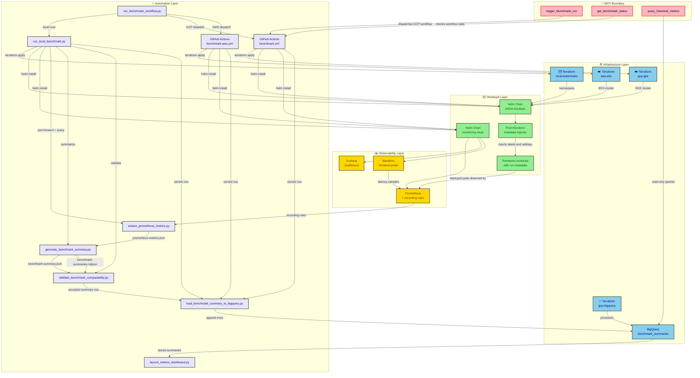
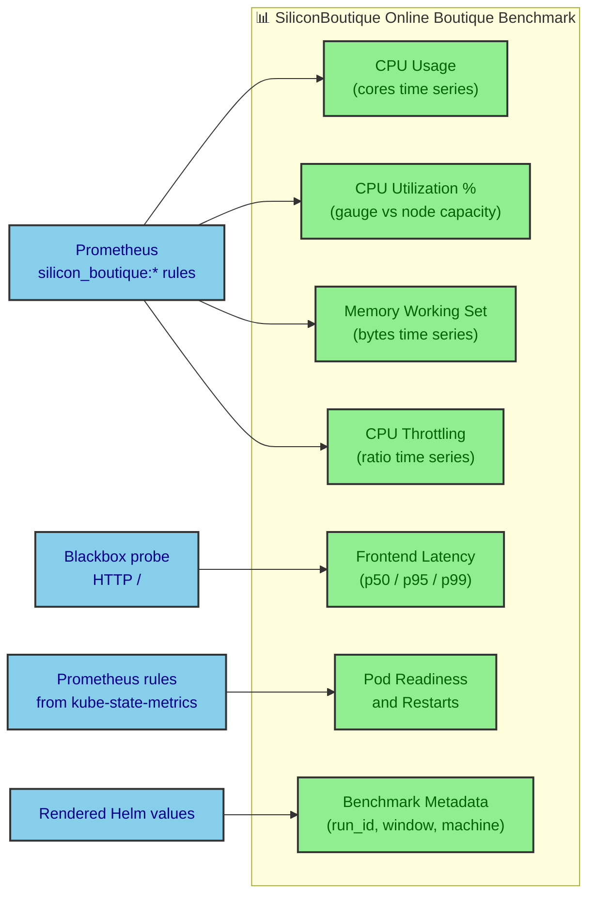

Comparing cloud processors sounds like a weekend project until you're three days in and still fighting reproducibility. Every run needs the same workload, the same observability stack, the same teardown guarantee, and somewhere to put the results that doesn't evaporate after the next run. SiliconBoutique puts all of that into a single pipeline you can trigger from one command, inspect in a live Grafana dashboard or a portable HTML page, and compare across GCP and AWS without opening a spreadsheet.

---

## What the system delivers

SiliconBoutique deploys Google's [Online Boutique microservices demo](https://github.com/GoogleCloudPlatform/microservices-demo) as the benchmark workload, collects CPU and memory metrics during a measured load window, writes a canonical `BenchmarkSummary` row to BigQuery for cloud runs and configured local runs, and gives you two ways to look at results: a private Grafana dashboard scoped to the live run, and a portable HTML dashboard generated from stored history.

The full pipeline is built around four concrete outputs:

- **A Terraform-managed execution target**: a fresh namespace in the local minikube profile, or a fresh GKE/EKS cluster for cloud runs, destroyed after the run.
- **Structured benchmark artifacts** covering CPU utilization, memory working set, CPU throttling, frontend probe latency, pod readiness, and container restarts.
- **A Grafana dashboard** scoped to the exact run and benchmark window, accessible via port-forward during local runs or verified through the Grafana API during cloud runs.
- **A `BenchmarkSummary` row in BigQuery** for cloud runs, and for local runs when BigQuery settings are configured, with cost fields, load profile metadata, and quality indicators that persist across teardown.

---

## How to run a benchmark

The main entrypoint is `run_benchmark_workflow.py`. It handles local runs, GCP dispatches, and AWS dispatches from a single interface. Pick the command that fits your situation.

### Local smoke run

```bash
python3 automation/scripts/run_benchmark_workflow.py \
  --target local \
  --profile smoke \
  --bigquery-env-file credential.env
```

This provisions a namespace in the `siliconboutique` minikube profile, deploys Online Boutique and the monitoring stack, runs the load generator, extracts Prometheus metrics, validates the summary, and tears down. If your `credential.env` has valid BigQuery settings, it also persists the row and verifies it remotely.

### GCP remote benchmark

```bash
python3 automation/scripts/run_benchmark_workflow.py \
  --target gcp \
  --project-id "$project_id" \
  --bigquery-env-file credential.env
```

This dispatches `.github/workflows/benchmark.yml` through the GitHub Actions API, waits for the workflow to finish, downloads the artifact, and verifies acceptance evidence. GCP Terraform never runs locally. The cloud workflow derives a `run_id` as `gha-<github-run-id>-<attempt>` and threads it through run-scoped resources, labels, artifacts, and the BigQuery row.

### Dashboard from stored results

```bash
python3 automation/scripts/launch_metrics_dashboard.py \
  --project-id "$project_id" \
  --dataset-id silicon_boutique \
  --table-id benchmark_summaries \
  --location US \
  --no-browser
```

This writes `artifacts/dashboard/index.html` and `artifacts/dashboard/dashboard-data.json` from BigQuery history. The same command works against a local NDJSON store by swapping `--summary-store artifacts/benchmark-summaries.ndjson`.

---

## Architecture overview

The system has five layers. Each layer communicates through structured artifacts and never imports the internals of another layer directly.



### Infrastructure layer

Terraform manages four roots. Three are ephemeral and scoped to a single `run_id`: the local Kubernetes namespace, the GCP GKE cluster with its VPC, and the AWS EKS cluster with its node group. The fourth, `gcp-bigquery`, is durable and never part of teardown. It provisions the BigQuery dataset and table once, and every cloud benchmark run appends a row to it; local runs do the same when BigQuery persistence is configured.

Label-capable or tag-capable resources created by an ephemeral root carry the `run_id` and provider metadata. Teardown fails the workflow job if Terraform destroy reports a non-zero exit code.

### Workload layer

The Online Boutique workload is packaged as a Helm chart pinned to upstream `onlineboutique` version `0.10.5`. A custom post-renderer written in Python injects SiliconBoutique run labels, teardown annotations, and load-generator environment variables into every rendered resource. This keeps the upstream chart untouched while guaranteeing every pod carries the right metadata for Prometheus label matching.

The monitoring chart installs a full `kube-prometheus-stack`, a `prometheus-blackbox-exporter`, defines `silicon_boutique:*` recording rules, and provisions the Grafana dashboard through a sidecar ConfigMap.

### Automation layer

Each automation script reads from an explicit input file and writes to an explicit output file. The unified coordinator, `run_benchmark_workflow.py`, calls the lower-level scripts directly for local runs or dispatches the GitHub Actions workflows for cloud runs. The same scripts run in a local terminal or inside GitHub Actions without modification.

---

## The benchmark pipeline sequence

A single benchmark run follows this sequence whether it runs locally, on GCP, or on AWS.

```mermaid
flowchart TD
    START([Start benchmark run]) --> PROVISION

    subgraph PROVISION_PHASE["1️⃣ Provision"]
        PROVISION["Terraform apply<br/>create namespace or cloud cluster"]
    end

    subgraph DEPLOY_PHASE["2️⃣ Deploy"]
        DEPLOY_WL["helm upgrade --install<br/>online-boutique chart"]
        WAIT_WL["kubectl wait<br/>all deployments Available"]
        DEPLOY_MON["helm upgrade --install<br/>monitoring chart"]
        WAIT_MON["kubectl rollout status<br/>Prometheus, Grafana, exporters"]
        DEPLOY_WL --> WAIT_WL --> DEPLOY_MON --> WAIT_MON
    end

    subgraph BENCHMARK_PHASE["3️⃣ Benchmark window"]
        WAIT_METRICS["Wait for required<br/>recording rules to populate"]
        RESTART_LG["Restart loadgenerator<br/>start measured window"]
        SLEEP["Sleep for test_duration<br/>(default 20m)"]
        UPDATE_DASH["Update Grafana dashboard<br/>with exact window timestamps"]
        WAIT_METRICS --> RESTART_LG --> SLEEP --> UPDATE_DASH
    end

    subgraph EXTRACT_PHASE["4️⃣ Extract"]
        PORT_FWD["kubectl port-forward<br/>Prometheus :9090"]
        EXTRACT_PROM["extract_prometheus_metrics.py<br/>query silicon_boutique:* rules"]
        EXTRACT_LG["kubectl logs loadgenerator<br/>parse Locust aggregate stats"]
        PORT_FWD --> EXTRACT_PROM
    end

    subgraph SUMMARIZE_PHASE["5️⃣ Summarize and validate"]
        GEN_SUMMARY["generate_benchmark_summary.py<br/>write summary JSON + NDJSON"]
        VALIDATE_SUM["validate_benchmark_comparability.py<br/>--mode summary --run-id"]
        LOAD_BQ["load_benchmark_summary_to_bigquery.py<br/>cloud required / local optional"]
        GEN_SUMMARY --> VALIDATE_SUM --> LOAD_BQ
    end

    subgraph TEARDOWN_PHASE["6️⃣ Teardown"]
        HELM_UNINSTALL["helm uninstall<br/>monitoring + workload"]
        TF_DESTROY["terraform destroy<br/>remove all run-scoped resources"]
        VERIFY_DESTROY["Verify teardown status<br/>fail job if destroy failed"]
        HELM_UNINSTALL --> TF_DESTROY --> VERIFY_DESTROY
    end

    PROVISION --> DEPLOY_WL
    WAIT_MON --> WAIT_METRICS
    UPDATE_DASH --> PORT_FWD
    UPDATE_DASH --> EXTRACT_LG
    EXTRACT_PROM --> GEN_SUMMARY
    EXTRACT_LG --> GEN_SUMMARY
    LOAD_BQ --> HELM_UNINSTALL
    VERIFY_DESTROY --> END([Artifacts uploaded])

    classDef step fill:#90EE90,stroke:#333,stroke-width:2px,color:darkgreen
    classDef end_node fill:#FFD700,stroke:#333,stroke-width:2px,color:#5a4000

    class PROVISION,DEPLOY_WL,WAIT_WL,DEPLOY_MON,WAIT_MON,WAIT_METRICS,RESTART_LG,SLEEP,UPDATE_DASH,PORT_FWD,EXTRACT_PROM,EXTRACT_LG,GEN_SUMMARY,VALIDATE_SUM,LOAD_BQ,HELM_UNINSTALL,TF_DESTROY,VERIFY_DESTROY step
    class START,END end_node
```



The automation waits for the `silicon_boutique:*` recording rules to produce live data before the clock starts. This reduces startup and warmup noise in the benchmark window, so the measured window is much closer to steady-state behavior.

The teardown phase runs with `if: always()` in GitHub Actions, so it executes even after extraction or summary failures. Terraform apply and destroy stay in the same job to keep the state file local and available for cleanup.

---

## Setting up on Google Cloud

Before dispatching a live GCP benchmark, three things need to be in place: a GCP project with billing enabled, a durable BigQuery destination, and GitHub OIDC credentials.

### Provision durable BigQuery storage

Provision once, before the first benchmark. This root is intentionally separate from the GKE root and must not be destroyed as part of teardown.

```bash
cd infra/terraform/gcp-bigquery
terraform init
terraform apply -auto-approve \
  -var="project_id=YOUR_GCP_PROJECT_ID" \
  -var="static_validation_mode=false"
```

This creates the `silicon_boutique` dataset and `benchmark_summaries` table, partitioned by `benchmark_start` and clustered by `machine_type`, `processor_family`, `architecture`, and `run_id`. To grant the GitHub Actions writer service account access at the same time, pass it as a variable.

```bash
terraform apply -auto-approve \
  -var="project_id=YOUR_GCP_PROJECT_ID" \
  -var="summary_writer_service_accounts=[\"your-sa@your-project.iam.gserviceaccount.com\"]" \
  -var="static_validation_mode=false"
```

### Configure GitHub OIDC and secrets

The benchmark workflow authenticates to GCP using GitHub OIDC, so no long-lived service account keys need to be stored. Set two secrets in your repository:

- `GCP_WORKLOAD_IDENTITY_PROVIDER` — the full workload identity provider resource name.
- `GCP_SERVICE_ACCOUNT` — the service account email.

The service account needs `roles/bigquery.jobUser` at the project level and `roles/bigquery.dataEditor` on the durable dataset. The BigQuery Terraform root manages these grants when you pass the service account email to `summary_writer_service_accounts`.

### Dispatch a benchmark

The coordinator dispatches the workflow and waits for it by default:

```bash
python3 automation/scripts/run_benchmark_workflow.py \
  --target gcp \
  --project-id "$project_id" \
  --machine-type c3-standard-4 \
  --processor-family c3 \
  --bigquery-env-file credential.env
```

To dispatch without waiting:

```bash
python3 automation/scripts/run_benchmark_workflow.py \
  --target gcp \
  --project-id "$project_id" \
  --bigquery-env-file credential.env \
  --no-wait \
  --dashboard skip
```

You can also dispatch directly through the `gh` CLI if you want control over every input:

```bash
gh workflow run benchmark.yml \
  -f project_id="YOUR_GCP_PROJECT_ID" \
  -f region=us-central1 \
  -f zone=us-central1-a \
  -f machine_type=c3-standard-4 \
  -f processor_family=c3 \
  -f architecture=x86_64 \
  -f pricing_model=spot \
  -f test_duration=20m \
  -f bigquery_dataset=silicon_boutique \
  -f bigquery_table=benchmark_summaries \
  -f bigquery_location=US \
  -f acceptance_demo=true
```

---

## Running locally in the devcontainer

The devcontainer is the fastest path to a working local environment. It pins Terraform 1.15.2, kubectl 1.36.0, Helm 4.1.4, and minikube 1.38.1. The post-create script boots the `siliconboutique` minikube profile automatically when Docker is reachable. Open the repository in VS Code with the Dev Containers extension and the environment is ready.

### Local smoke benchmark

```bash
python3 automation/scripts/run_benchmark_workflow.py \
  --target local \
  --profile smoke \
  --bigquery-env-file credential.env
```

For lower-level debugging, you can call the orchestration script directly with a short duration:

```bash
python3 automation/scripts/run_local_benchmark.py \
  --test-duration 2m \
  --min-duration-seconds 60
```

### Inspect the Grafana dashboard locally

Add `--skip-destroy` to leave the namespace alive after extraction, then port-forward Grafana in a second terminal:

```bash
python3 automation/scripts/run_local_benchmark.py \
  --test-duration 5m \
  --min-duration-seconds 60 \
  --skip-destroy

# In another terminal:
cd infra/terraform/local-kubernetes
namespace="$(terraform output -raw namespace)"
cd ../../..

kubectl port-forward service/sb-monitoring-grafana \
  3000:80 \
  --namespace "$namespace" \
  --context siliconboutique
```

Get the admin password:

```bash
kubectl get secret sb-monitoring-grafana \
  --namespace "$namespace" \
  --context siliconboutique \
  -o jsonpath='{.data.admin-password}' | base64 -d
```

Open `http://127.0.0.1:3000`, log in with `admin`, and open the `SiliconBoutique Online Boutique Benchmark` dashboard. The default time range is the last 30 minutes, which covers short local runs.

### What the Grafana dashboard shows

The dashboard has seven panels, each scoped to the exact `run_id` and namespace of the current run.



The CPU utilization gauge is worth pointing out specifically. It measures workload CPU usage divided by allocatable CPU cores on nodes running benchmark pods, with node capacity as a fallback when allocatable metrics are unavailable. This normalization against actual node capacity makes it meaningful for cross-machine comparison.

---

## What a benchmark summary looks like

After a successful run, `artifacts/benchmark-summary.json` contains the canonical result. Here's a representative example from a local smoke run:

```json
{
  "run_id": "local-smoke-20260514-120000",
  "namespace": "silicon-boutique-local-smoke-20260514-120000",
  "environment": "local",
  "cloud_provider": "local",
  "region": "local",
  "zone": "local",
  "machine_type": "local",
  "processor_family": "local",
  "cpu_platform": null,
  "architecture": "x86_64",
  "node_count": 1,
  "pricing_model": "local",
  "benchmark_start": "2026-05-14T12:00:00Z",
  "benchmark_end": "2026-05-14T12:02:00Z",
  "duration_seconds": 120,
  "generated_at": "2026-05-14T12:02:10Z",
  "avg_cpu_usage_cores": 1.87,
  "max_cpu_usage_cores": 2.49,
  "avg_cpu_utilization_pct": 46.8,
  "max_cpu_utilization_pct": 62.3,
  "avg_memory_working_set_bytes": 1432150016,
  "max_memory_working_set_bytes": 1480000000,
  "max_memory_used_gb": 1.48,
  "avg_cpu_throttling_ratio": 0.01,
  "max_cpu_throttling_ratio": 0.03,
  "min_ready_pods": 12,
  "avg_ready_pods": 12,
  "max_ready_pods": 12,
  "max_restarts_total": 0,
  "frontend_latency_p50_ms": 68.4,
  "frontend_latency_p95_ms": 142.7,
  "frontend_latency_p99_ms": 210.3,
  "frontend_latency_max_ms": 340.1,
  "request_count_total": 1823,
  "request_success_count": 1820,
  "request_failure_count": 3,
  "avg_requests_per_second": 15.19,
  "load_concurrent_users": 10,
  "load_users_per_second": 1,
  "load_profile_source": "manual",
  "node_hourly_price_usd": null,
  "benchmark_compute_cost_usd": null,
  "cost_per_1m_requests_usd": null,
  "metrics_coverage_ratio": 1.0,
  "missing_metrics": [],
  "empty_metrics": [],
  "invalid_metric_samples": {},
  "summary_status": "complete"
}
```

For priced cloud runs, `node_hourly_price_usd`, `benchmark_compute_cost_usd`, and `cost_per_1m_requests_usd` are populated from the machine pricing table in `automation/templates/machine-pricing.json`.

`summary_status` is `complete` only when all required metrics are present, the coverage ratio is at or above 0.95, and the load-generator stats parsed successfully. A `partial` summary is still written but excluded from comparability validation.

---

## Viewing results in the portable dashboard

Once you have benchmark results stored in BigQuery or in a local NDJSON file, you can generate a portable dashboard from them. This dashboard is separate from the live Grafana dashboard: it visualizes stored summaries after runs complete, not live Kubernetes metrics during a run.

```bash
python3 automation/scripts/launch_metrics_dashboard.py \
  --project-id "$project_id" \
  --dataset-id silicon_boutique \
  --table-id benchmark_summaries \
  --location US \
  --no-browser
```

The launcher writes `artifacts/dashboard/index.html` and `artifacts/dashboard/dashboard-data.json`, then prints a localhost URL. Use `--no-serve` when you want the files without starting a local server. The dashboard groups runs by machine type, processor family, architecture, and load profile, ranks them on latency, throughput, memory efficiency, and cost, and lists rejected runs explicitly rather than silently dropping them.

---

## The end-to-end acceptance demo

The acceptance demo is the fastest way to prove the full local path works from start to finish:

```bash
python3 automation/scripts/run_acceptance_demo.py \
  --mode local \
  --run-id local-demo \
  --test-duration 2m \
  --min-duration-seconds 60
```

This runs the benchmark, verifies the Grafana dashboard through the API (not just the ConfigMap), checks the summary, validates summary quality and comparability readiness, and writes `artifacts/acceptance-demo-report.json`. The report's `checks.dashboard.grafana_load_status.status` must be `passed` for the demo to succeed. That check actually queries the Grafana API using the generated admin secret; it doesn't just confirm the ConfigMap exists.

For a bounded inspection window before cleanup resumes:

```bash
python3 automation/scripts/run_acceptance_demo.py \
  --mode local \
  --dashboard-hold-seconds 120
```

This gives you two minutes to browse the dashboard before the script tears everything down and writes the final report.

---

## Multi-cloud comparison

Once you have GCP and AWS artifact sets downloaded, the acceptance matrix ties them together:

```bash
python3 automation/scripts/run_acceptance_matrix.py \
  --mode verify \
  --gcp-artifacts artifacts/gcp-run \
  --aws-artifacts artifacts/aws-run
```

This writes `artifacts/acceptance-matrix-report.json`, `acceptance-matrix-comparison.json`, and a Markdown comparison table ranking the two providers on latency, throughput, and cost. Each artifact directory must contain matching `workflow-trace.json`, `benchmark-summary.json`, `acceptance-demo-report.json`, `comparability-report.json`, `bigquery-load-report.json`, and `teardown-status.env` for the same `run_id`.

After verification, pull up the full picture in the portable dashboard:

```bash
python3 automation/scripts/launch_metrics_dashboard.py \
  --project-id "$project_id" \
  --dataset-id silicon_boutique \
  --table-id benchmark_summaries \
  --location US \
  --no-browser
```

At that point you have reproducible data, teardown evidence, and a visual comparison sitting in one place. That's the whole point.
