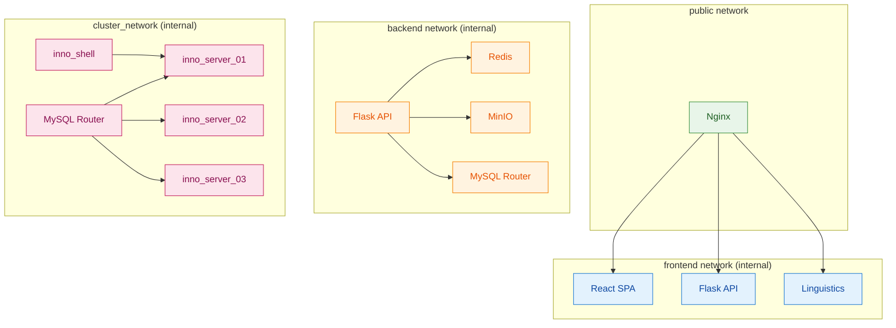
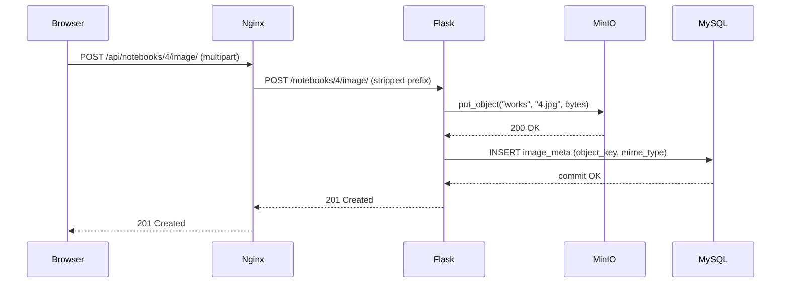

When you type `docker-compose up` in the Sin Pluma repo, ten containers start and wire themselves into a system that handles web traffic, API requests, object storage, session management, database writes, and machine learning inference. None of them share a network segment they don't need. Understanding why each piece sits where it does is the fastest way to understand how the whole thing works.

---

## Logical layers

Sin Pluma maps cleanly onto five architectural layers, each with a distinct responsibility.

The **edge layer** is Nginx. It routes traffic, terminates TLS, and exposes a single public surface for the SPA and APIs. Nothing reaches the backend without passing through here first.

The **application layer** is Flask. This is where business rules live: authentication, user management, content creation, image uploads, and the coordination of all supporting services.

The **auxiliary services layer** is the linguistics microservice. It handles text analysis and sentiment endpoints, completely isolated from the main application.

The **storage layer** has three components with three different jobs. MySQL InnoDB Cluster handles transactional data with ACID guarantees. MinIO stores binary assets like images. Redis holds ephemeral state like revoked JWT identifiers.

The **orchestration layer** is Docker Compose, which makes the entire stack reproducible with a single command.

The design deliberately favors **one authoritative transactional store** for critical content and user state, with specialized systems for media and ephemeral data.

---

## The service catalog

Each element in the service catalog is a distinct container. Here's what each one owns.

| Service                | Role                               | Stack                       |
| ---------------------- | ---------------------------------- | --------------------------- |
| `nginx`                | Reverse proxy, single entry point  | Nginx                       |
| `react`                | SPA served to browsers             | React, Redux, Slate         |
| `flask`                | REST API, business logic           | Python, Flask, Gunicorn     |
| `linguistics`          | Sentiment analysis endpoint        | Python, Flask, scikit-learn |
| `minio`                | Object storage for images          | MinIO                       |
| `redis`                | JWT blacklist, short-lived cache   | Redis                       |
| `inno_router`          | MySQL Router, cluster proxy        | MySQL Router                |
| `inno_server_01/02/03` | MySQL nodes with group replication | MySQL 8                     |
| `inno_shell`           | Bootstrap container, runs once     | MySQL Shell                 |

The `inno_shell` container is not a long-running service. It starts, configures the cluster, imports the schema, and exits. The router and API then take over.

---

## Network isolation

The containers sit on four Docker networks with explicit membership rules. This is how the system limits blast radius if a service is compromised.



Nginx is the only container on the `public` network. The React, Flask, and Linguistics containers share the `frontend` internal network so Nginx can reach them but they can't reach the internet. Flask also sits on the `backend` network so it can talk to Redis, MinIO, and the MySQL Router. The three MySQL nodes and the router live exclusively on `cluster_network`. Flask talks to the router but never to individual nodes directly.

---

## How request routing works in Nginx

Nginx uses path-based routing to send traffic to the right backend.

```nginx
location /api/lin/ {
    proxy_pass http://linguistics:5001/;
}

location /api/ {
    proxy_pass http://flask:5000/;
}

location / {
    proxy_pass http://react:3000/;
}
```

The `/api/lin/` prefix strips and forwards to the linguistics container. The `/api/` prefix strips and forwards to Flask. Everything else goes to the React dev server. The Nginx container is the only public entry point, which keeps the surface area small.

---

## Inter-service interactions and key data flows

The architecture makes more sense when you trace what happens during specific operations. Four flows cover the most important paths.

### Saving a draft notebook

A typical write flow demonstrates the transactional guarantees the cluster provides.

1. The browser POSTs to `/api/notebooks`.
2. Nginx proxies to Flask.
3. Flask validates input through Marshmallow, begins a SQLAlchemy database transaction, and writes the notebook record to the InnoDB cluster via MySQL Router.
4. The write commits with ACID guarantees. If the commit fails, no partial state is visible.
5. Flask returns the created resource ID to the frontend, which updates Redux state.

### Image upload flow



Flask streams the file directly from the request into MinIO. It then writes image metadata (object key, MIME type, size) into MySQL inside a transaction. If the database write fails, the object is marked for cleanup. This ordering ensures no dangling references ever land in the relational store.

### Sentiment analysis flow

The frontend calls `/api/lin/sentiment?key={id}&sentence={text}` for each sentence in the current page. Nginx routes these to the linguistics container. The linguistics service loads a pre-trained scikit-learn logistic regression model at startup, from a pickled `.pckl` file, runs inference synchronously, and returns a JSON object with the key and a `positive` or `negative` label. The React editor component annotates the text inline using Slate.js annotations. No database writes are required; the interaction is fully stateless.

### Token refresh flow

Every outgoing API request from React goes through an Axios interceptor. If the API returns a 401 with `"Token has expired"`, the interceptor pauses all pending requests, sends a POST to `/api/refresh` with the refresh token in the Authorization header, gets a new access token, updates `localStorage`, and replays all the queued requests with the new token. The user never sees a login prompt unless the refresh token itself has expired.

---

## Design trade-offs worth knowing

A few choices in this architecture deserve explanation because they aren't obvious defaults.

**JWT + Redis is a deliberate hybrid.** Pure JWT is stateless, which means you can't revoke a token before it expires. Sin Pluma stores the JTI (the unique identifier inside the token) in Redis on logout with an expiry matching the token's remaining lifetime. The `token_in_blacklist_loader` callback in Flask checks Redis on every protected request. This costs one Redis round trip per request but gives real revocation semantics.

**Object storage over filesystem** means the Flask container can be restarted, re-deployed, or replaced without losing any data. Images live in MinIO, which has its own data volume. The API becomes stateless with respect to file storage.

**MySQL Router over a direct node connection** means Flask always gets the primary node for writes and can load-balance reads. If a node fails, the Router detects it and routes around the failure. Flask's connection string never changes.

**SQL LIKE-based search** keeps things simple. The platform doesn't have a dedicated search index, which means search won't scale for large content sets and lacks relevance tuning. For the current scope it works fine; a dedicated search engine would be the natural next step.

---

## Architectural strengths and constraints

**Strengths.** The system has clean separation of concerns: API, NLP, media, and the database each have clear ownership. The InnoDB cluster provides strong transactional guarantees for critical state. The bootstrapping automation makes the entire stack reproducible. Simple, pragmatic stacks throughout enable fast development and clear ownership boundaries.

**Constraints.** There's no async event bus, which limits scalability for tasks like indexing, notifications, and background processing. SQL LIKE-based search won't scale for large content sets. Docker Compose-based database clustering is suitable for demos but would require migration to an operator or managed service for production-grade operations. The architecture also has no service-to-service authentication between internal containers; network isolation provides the boundary, not identity.

---

## Deployment and local runtime

Docker Compose describes the entire stack in one file. Compose provides a reproducible demo environment that clarifies service wiring for reviewers. The boot sequence enforces ordering: MySQL nodes start first, the shell bootstrap runs and waits for all three nodes, then the router starts, then Flask and the other services. This ordering is critical. The bootstrap script waits until each MySQL node accepts connections before attempting cluster creation.

For production, the architecture anticipates migration to Kubernetes with a MySQL Operator for database lifecycle management. The script-based automation maps well to Ansible or operator-based approaches; the logic is the same, just the execution environment changes.
