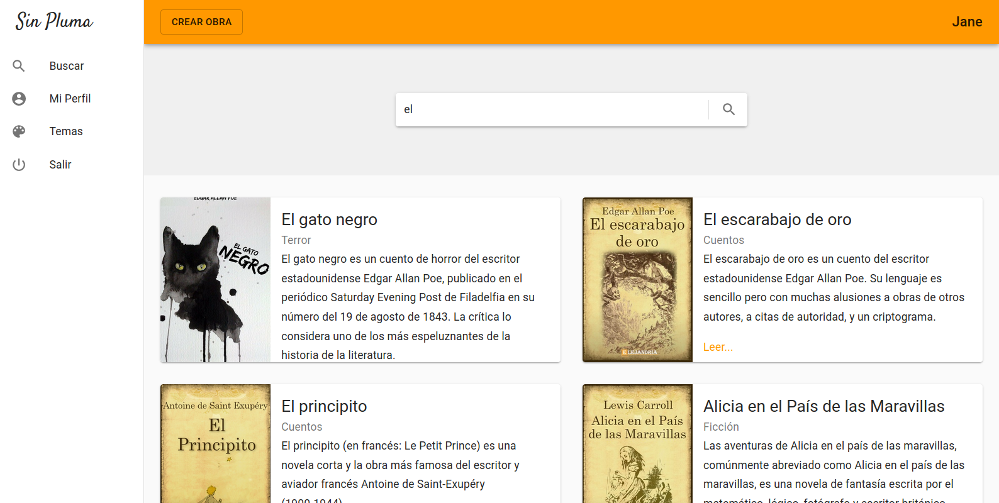
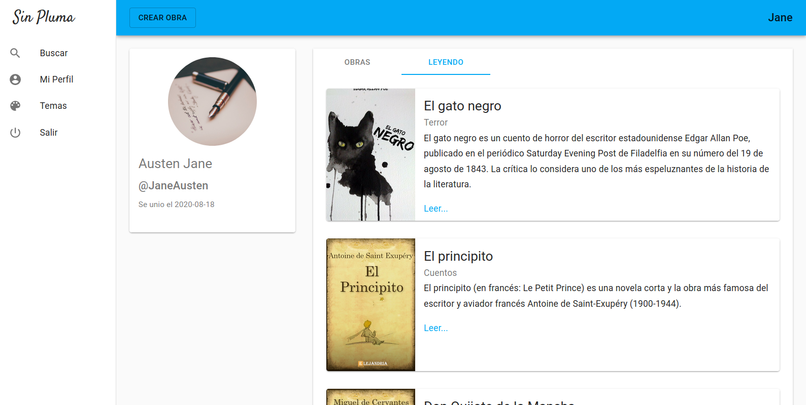
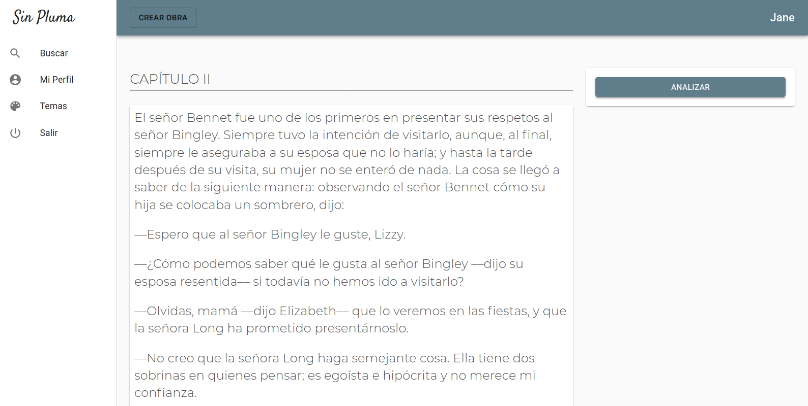
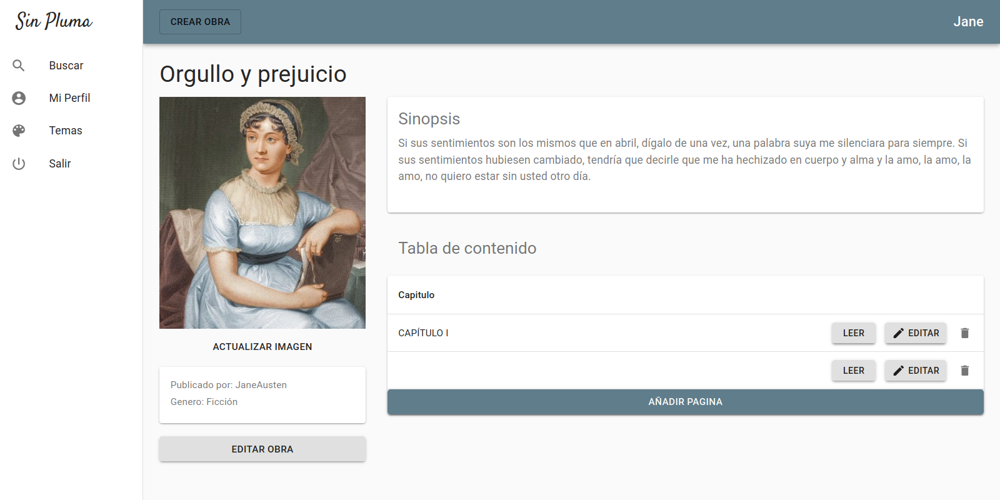

This publication isolates the **Frontend Architecture** of SinPluma and examines it in detail. It explains the technology stack, internal structure, routing model, state management strategy, page composition, and the integration patterns used to communicate with backend services.

The objective is to demonstrate frontend engineering capability beyond interface design. The focus is on architectural decisions, maintainability, and the ability to scale the application over time.


---

## 1. Frontend Overview

SinPluma’s frontend is implemented as a **Single Page Application (SPA)** built with React. The application functions as a writing platform where users can:

- Create and manage notebooks
- Write structured multi-page documents
- Upload and embed images
- Read published work
- Search for content
- Receive real-time linguistic feedback while writing

Although the user experience centers on writing, the underlying architecture prioritizes long-term maintainability and clear system boundaries.

Key architectural goals include:

- Modular component design
- Predictable state management
- Clear API communication layers
- Separation between presentation and business logic
- Scalable routing and layout composition

---

## 2. Technology Stack & Core Libraries

### 2.1 Core Framework

- **React**  
  The application uses a component-driven UI architecture. Functional components and React hooks encapsulate state and lifecycle behavior within isolated UI units.

- **React Router**  
  Handles client-side navigation and enables URL-based state representation. Routes such as `/notebooks/:id` or `/read/:slug` directly map the URL to application state.

This routing model keeps navigation predictable and allows pages to be addressed directly.



---

### 2.2 State Management

- **Redux**

  Redux manages global application state across the entire frontend.

  The store contains:
  - Authentication state
  - Notebook metadata
  - Document pages
  - UI state and loading indicators

  State transitions occur through **reducers**, ensuring that updates remain deterministic and traceable.

  Actions represent domain events, for example:
  - `CREATE_NOTEBOOK`
  - `LOAD_PAGES`
  - `LOGIN_SUCCESS`

This model separates responsibilities clearly:

- React components render the interface
- Redux reducers define state transitions
- Asynchronous actions handle API communication

The result is a predictable data flow that simplifies debugging and future extensions.

---

### 2.3 Rich Text Editing

- **Slate.js**

  The writing experience is powered by Slate, a customizable rich-text editing framework designed for structured documents.

  Slate enables features such as:
  - Inline formatting like bold, italic, and headings
  - Structured content blocks
  - Embedded media such as images
  - Custom plugins, including sentiment analysis feedback

Slate was selected instead of simpler editors for several reasons:

- It exposes a full document tree representation.
- Rendering and editing behavior can be customized in detail.
- It integrates naturally with React’s state model.

This flexibility makes it well suited for a writing platform rather than a basic text field.

---

### 2.4 UI & Component Library

- **Material UI (MUI)**

  Material UI provides standardized components used throughout the interface, including:
  - Buttons
  - Forms
  - Dialogs
  - Navigation bars

The library also supports theming, which centralizes style definitions and keeps visual behavior consistent across the application.

Using MUI reduces the need for custom CSS while maintaining a coherent design system.



---

### 2.5 API Communication

- **Axios**

  Axios acts as the HTTP client layer for all communication with backend services.

  A centralized Axios configuration manages:
  - The base API URL
  - Authorization headers containing the JWT token
  - Global error interceptors

API calls are typically executed inside Redux asynchronous actions, following a middleware pattern such as thunks.

This abstraction keeps network logic separate from UI components.

---

## 3. Frontend Architecture

The frontend follows a layered SPA architecture organized around clear functional boundaries.

```
    /src
    /components
    /pages
    /store
    /reducers
    /actions
    /services
    /utils
```

Each directory represents a distinct responsibility within the client application.

---

### 3.1 Component Layer

The component layer contains reusable UI elements such as:

- Editor components
- Toolbar controls
- Navigation bars
- Page lists
- Modal dialogs

Most components are intentionally lightweight. They either remain stateless or maintain minimal local state.

Access to global data occurs through Redux hooks such as:

- `useSelector` for reading state
- `useDispatch` for triggering actions

This design keeps UI elements reusable and independent from business logic.



---

### 3.2 Pages Layer (Route-Based Composition)

The pages layer contains high-level components mapped directly to application routes.

Each page composes lower-level components and orchestrates data loading.

Key pages include the following.

---

#### 1. Authentication Pages

Authentication pages handle user entry into the platform.

They include:

- Login
- Registration
- Password validation flows

Responsibilities include:

- Form validation
- Requesting authentication tokens
- Updating the Redux authentication state

---

#### 2. Dashboard / Notebooks Page

The dashboard displays the user’s notebooks and acts as the primary entry point after login.

Users can:

- View existing notebooks
- Create new notebooks
- Delete notebooks

Notebook data is retrieved from the backend endpoint `/api/notebooks`.

Typical state flow:

1. The page loads.
2. An asynchronous Redux action dispatches an API request.
3. The response updates the Redux store.
4. React components re-render based on the new state.

---

#### 3. Notebook Editor Page

The notebook editor is the core writing interface and the most complex page in the application.

Key responsibilities include:

- Loading notebook pages dynamically
- Managing Slate editor state
- Saving document changes through API requests
- Rendering embedded images
- Triggering linguistic analysis services

The page also implements:

- Autosave behavior
- Debounced persistence requests
- Optimistic UI updates

These mechanisms ensure writing remains responsive while maintaining data integrity.



---

#### 4. Reader Page

The reader page presents published content in a simplified reading interface.

Characteristics include:

- Minimal UI
- Stateless rendering
- Content fetched by slug or document identifier

The goal is to provide a distraction-free reading experience.

---

#### 5. Search Page

The search page enables users to discover notebooks and published writing.

Core elements include:

- A query input field
- Result listing components
- API-driven data retrieval

Results are rendered dynamically based on backend responses.

---

## 4. State Flow & Data Lifecycle

SinPluma follows a predictable state lifecycle that governs how data moves through the application.

1. A user interaction triggers a Redux dispatch.
2. An asynchronous action performs the API request.
3. The backend response updates the Redux store.
4. React components re-render from the updated state.

This model provides several benefits:

- Deterministic UI updates
- A clear debugging path
- Strict separation between UI rendering and business logic

---

## 5. Integration with Backend Services

### 5.1 Authentication Flow

The authentication process follows a token-based model.

1. The user submits login credentials.
2. The backend returns a JWT token.
3. The token is stored in Redux and optionally persisted in local storage.
4. Axios attaches the token to future requests through authorization headers.
5. Logging out removes the token and resets authentication state.


---

### 5.2 Image Upload Flow

Image uploads occur directly from the editor interface.

The process works as follows:

1. The editor selects an image file.
2. The frontend sends a multipart upload request.
3. The backend stores the file in MinIO object storage.
4. The resulting URL is returned to the client.
5. The editor embeds the URL inside the Slate document structure.

This approach allows images to behave as structured document elements.

---

### 5.3 Linguistics Service Integration

The writing assistant feature integrates with an external linguistic analysis service.

The workflow is lightweight:

1. The editor sends sentence text to the service.
2. The service returns sentiment or tone classification.
3. The UI visually highlights the feedback.

The interaction remains stateless and does not persist additional client data.

---

## 6. Build & Deployment

The frontend is distributed as a containerized application using Docker.

The build and deployment process follows these steps:

- A production bundle is generated using `npm run build`.
- Static assets are served through an Nginx container.
- Environment variables are injected during the build stage.
- The container runs behind a reverse proxy that routes API traffic.

This deployment model provides several operational advantages:

- Portability across environments
- Simple configuration through environment variables
- Easy integration with backend services in container orchestration setups

---

## 7. Architectural Strengths

The frontend architecture provides several important advantages:

- Clear separation between UI rendering, state logic, and side effects
- A rich document model built on Slate
- Predictable global state management through Redux
- Modular routing and page composition
- Scalable component organization
- Clean API communication through Axios
- Containerized deployment ready for production environments

---

## 8. Architectural Constraints

Some trade-offs exist in the current design:

- Redux introduces boilerplate for smaller UI interactions.
- No dedicated client-side caching layer such as React Query is present.
- Search behavior depends heavily on backend SQL queries.
- The application lacks server-side rendering, which limits search engine indexing for public content.

---

## Closing Summary

The SinPluma frontend operates as a structured client application rather than a simple user interface.

Its architecture combines:

- Modular component design
- Deterministic state transitions
- A rich text document model
- Clean backend API integration
- A containerized production build

Together these elements demonstrate core frontend engineering capabilities, including disciplined state management, complex editor integration, real-world API interaction, and a maintainable SPA routing structure.
