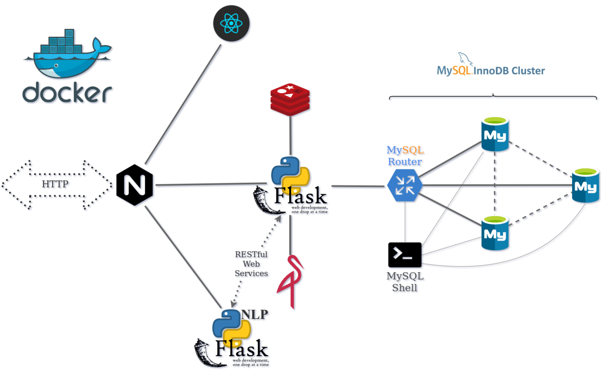
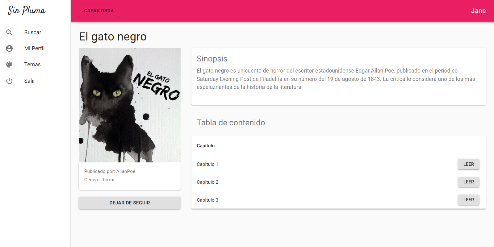

# Building SinPluma and the Architecture Behind It

Second Place at the DIVEC Project Exposition 2019B.

SinPluma began as a writing platform where authors can create, edit, publish, and read works. The product itself matters, though the engineering behind it mattered more during development. The goal was to build something closer to a real service than a simple classroom project.

A modern editor, a clean API, and a resilient database layer shaped the direction early on. The entire system needed to start with a single command, run inside containers, and demonstrate realistic operational concerns.

The final platform runs as a containerized system composed of a React application, a Flask API, several infrastructure services, and a three node MySQL cluster managed through MySQL Shell.

## Overview

From the user perspective the platform stays simple. Writers log in, create notebooks, edit pages, embed images, follow other authors, and read published work. The editor lives inside a React single page application built on top of the Slate rich text framework.

Behind that interface sits an API responsible for authentication, persistence, media storage, and service coordination.

Instead of a single monolithic application process, the platform runs as several cooperating services connected through HTTP and internal networking.

The system includes the following major components.

- a Flask API service
- a small linguistics service for text analysis
- MinIO object storage
- Redis for token state
- an InnoDB Group Replication cluster
- an Nginx gateway that routes external traffic

Treating the system as a distributed architecture created a much more interesting engineering challenge than a traditional CRUD application.

## Architectural Goals

Several design goals guided the structure of the system.

The platform follows an API first model. Every operation inside the application flows through a JSON endpoint. The React client consumes the same interface that a mobile or external client could use.

High availability for the database came next. User accounts and written content represent the core of the platform. Storing everything in a single database instance felt limiting for a system meant to demonstrate realistic infrastructure.

Separation of concerns also influenced the architecture. Transactional logic belongs in the API layer. Media files belong in object storage. Text analysis should run independently from the main application.

Automation became the final requirement. The system needed to bootstrap itself automatically inside Docker Compose without manual setup.

## The API Layer

At the center of the system sits the Flask API.

This service exposes the canonical backend interface for the entire platform. Authentication, user profiles, notebooks, pages, reading activity, and image uploads all pass through this layer.

The API runs on Python 3.8 and relies on a set of libraries chosen for stability and familiarity.

Flask provides the web framework. Flask RESTful structures the API routes. Flask JWT Extended handles token authentication. SQLAlchemy manages database access through PyMySQL. Marshmallow serializes request data and responses. Bcrypt secures user passwords.

Two additional services integrate directly with the API. Media files store in MinIO while revoked authentication tokens persist in Redis.

Most user interactions translate into straightforward database transactions. Editing a page or publishing a notebook triggers operations executed through SQLAlchemy.

Database connections route through MySQL Router rather than a specific database node. That small detail keeps the application unaware of the cluster topology.

## The Linguistics Service

A small companion service handles text analysis.

The editor can request sentence level sentiment information while the user writes. When the frontend sends a sentence fragment, Nginx routes the request to a dedicated Flask container responsible for processing it.

The service relies on scikit learn for a lightweight sentiment model.

Keeping the NLP functionality separate allows the main API to remain focused on transactional behavior.

## The Frontend Application

The client side runs as a React single page application.

Redux manages application state while Slate powers the rich text editor. Slate allows content to behave more like structured blocks than traditional HTML text editing.

Material UI supplies the visual components used across the interface. Axios handles communication with backend services.

Most user actions occur asynchronously. The interface updates immediately while the client synchronizes changes with the API.

Image uploads follow the same path. Files travel through the API before landing in object storage.

## Object Storage with MinIO

Binary assets rarely belong inside relational databases.

MinIO provides an S3 compatible object storage system that runs alongside the other services. Profile images and images embedded in notebooks store as objects inside this service.

The relational database only stores references to those objects.

This mirrors how many production SaaS platforms manage media storage.

## Redis and Token Management

Redis handles small pieces of short lived application state.

The primary responsibility involves revoked authentication tokens. When a token becomes invalid its identifier stores inside Redis. Each request checks this blacklist before allowing access.

Redis can also support lightweight caching if needed.

## Nginx as the Entry Point

Every external request enters the system through Nginx.

The gateway inspects the request path and routes traffic to the appropriate service.

Requests to the root path serve the React application. API requests route to the Flask service. Linguistics requests route to the text analysis service.

This structure provides a single public entry point for the entire platform.

## The InnoDB Cluster

The database layer became the most interesting part of the project.

Instead of deploying a single MySQL instance, the platform runs a three node InnoDB Group Replication cluster. Each node maintains a synchronized copy of the database.

Group Replication handles leader election and replication across nodes.

MySQL Router sits in front of the cluster and exposes a single logical endpoint. The API communicates with the router rather than with individual database instances.

If the primary node fails, Router redirects traffic to another node automatically.

From the perspective of the application nothing changes.

## Cluster Automation

Managing a cluster manually would defeat the purpose of the architecture.

A MySQL Shell script handles the entire bootstrap process. When the containers start, the shell container waits until each database node becomes reachable.

The script then configures every instance, creates the cluster if it does not exist, and adds the remaining nodes.

The same process loads an initial SQL file containing the database schema.

From a clean environment the full infrastructure comes online with a single command.

## Request Flow Through the System

The runtime flow stays predictable.

A browser sends a request to Nginx. The gateway forwards the request to the correct service. The Flask API handles most interactions and communicates with the database through MySQL Router.

If the request requires text analysis, Nginx forwards it to the linguistics service. Image uploads travel through the API and land inside MinIO.

Authentication tokens accompany every request. Redis stores the blacklist used to validate them.

Each service performs a narrow responsibility while the API coordinates the overall workflow.

## Tradeoffs in the Design

Several decisions favored simplicity over maximum scalability.

Most domain logic lives inside a single Flask service. Splitting the system into many microservices would add operational complexity without providing clear benefits for the project scope.

Processing also remains synchronous. Background queues or message brokers were intentionally avoided.

Search functionality uses simple SQL queries instead of a dedicated indexing engine. For a small dataset this approach remains sufficient.

Docker Compose orchestrates the environment. A production system would likely require a stronger orchestration platform.

Each choice reduced infrastructure overhead while keeping the architecture understandable.

## Improvements for the Future

Several additions could push the platform toward production readiness.

An event broker could support asynchronous jobs such as indexing, notifications, or analytics. A dedicated search engine would improve discovery of written content.

Database lifecycle management could move to a Kubernetes operator or managed database service.

Schema migrations, stronger automated tests, and proper secret management would improve operational discipline.

Observability would benefit from metrics, tracing, and structured logs.

Real time collaboration would require a synchronization layer based on operational transforms or CRDT models.

## Final Thoughts

SinPluma became more than a writing platform. The project evolved into a practical exercise in designing and operating a distributed system.

The architecture combines a modern editor, a containerized API, object storage, Redis state management, and a replicated MySQL cluster that initializes itself automatically.

The cluster automation remains the most satisfying part of the system. Watching a full database cluster configure itself inside Docker marked the moment the project started to feel like real infrastructure rather than a simple prototype.

With stronger search capabilities, asynchronous processing, and improved observability, the platform could evolve from an academic project into a production SaaS system.
