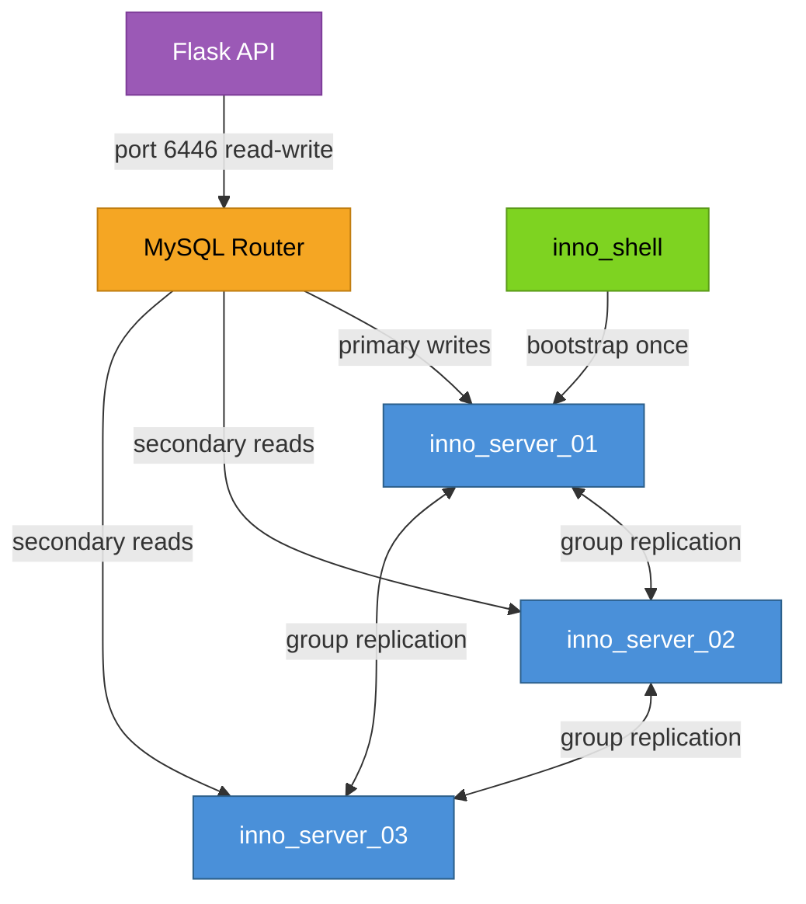
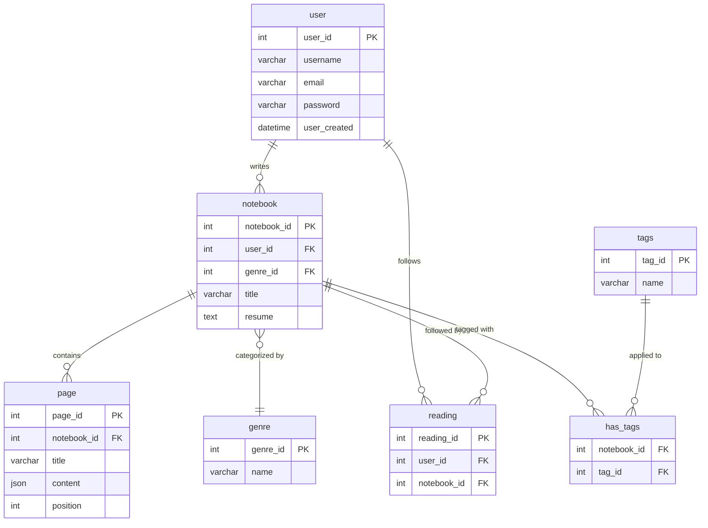

Running a single MySQL container is fine until it isn't. The moment that container restarts, your database is unavailable and your API is returning 500s. Sin Pluma sidesteps that problem by running MySQL InnoDB Cluster with three nodes and a router in front of them. When one node goes down, the cluster elects a new primary and the router updates its routing table automatically. The API keeps working. This post covers how the cluster is set up, how the schema is structured, what happens at boot time, and what production hardening beyond the demo environment looks like.

---

## What the cluster achieves

The InnoDB Cluster is the canonical ACID transactional layer for Sin Pluma. Its goals are specific and worth naming up front.

**High availability** means the system tolerates node failure without losing the ability to serve reads and writes. A three-node cluster can survive one node going down; the two remaining nodes still form a majority.

**Transactional consistency** provides ACID guarantees for critical entities: users, notebooks, pages, and their relationships. Content you write is content that persists correctly, even if a node fails mid-transaction.

**Automatic failover** means operators don't need to intervene when the primary fails. The group elects a new primary and MySQL Router updates its routing table. The application's connection string never changes.

**Simplified application connectivity** comes from MySQL Router presenting a single logical endpoint. Flask connects to `inno_router:6446` and never needs to know which node is currently primary.

---

## Cluster components

The cluster runs four MySQL-related containers, all on the `cluster_network` internal network.



**MySQL Server instances** run `mysqld` with Group Replication enabled. Each instance holds a full copy of the dataset and participates in group consensus for replication. Key configuration elements include `gtid_mode = ON` and `enforce_gtid_consistency = ON` for deterministic replication, `binlog_format = ROW` required by Group Replication, `log_slave_updates = ON` to relay group-applied transactions, `transaction_write_set_extraction` enabled for conflict detection, and unique `server_id` plus `report_host` per instance for proper group communication inside container networks. Each node's `/var/lib/mysql` mounts to a Docker volume so data survives container restarts.

**MySQL Router** is a lightweight proxy that exposes logical endpoints: port 6446 for read-write traffic (routes to the current primary), and port 6447 for read-only traffic (load-balanced across replicas). Applications connect to the Router and never need to manage individual node addresses or failover logic.

**MySQL Shell** (`inno_shell`) is the bootstrap container. It runs MySQL Shell's Python API (`dba`, `cluster`) to configure instances, create the cluster, and add nodes. This is not a long-running service. It starts, does its work, and exits.

---

## The schema

The schema SQL lives at `innodbCluster/sinpluma.sql`. It defines seven tables plus seed data.



A few design notes. The `page.content` column uses MySQL's native JSON type, which stores Slate's document tree without a separate serialization step. The `reading` table is a simple join: one row per user-notebook follow relationship. The `tags` and `has_tags` tables are defined but have no API coverage yet. The schema seeds ten genres on import so the frontend has data from the first boot.

---

## Cluster automation and bootstrapping

The bootstrap logic lives in `innodbCluster/mysql_shell/create_cluster.py`. The script handles two scenarios: first boot (create the cluster from scratch) and restart after all nodes were stopped (reboot an existing cluster).

### Steps the automation performs

1. Start MySQL server containers with base CNF files mounted, one per node.
2. Wait for MySQL to become available, checking TCP port and connection acceptance.
3. Run the MySQL Shell script, which configures each instance with `dba.configureInstance()`, creates the cluster with `dba.createCluster()` if none exists, adds secondary nodes with `cluster.addInstance()`, and optionally loads the SQL seed file once the cluster is healthy.
4. Start MySQL Router with configuration referencing the cluster metadata schema.
5. Application connects to the Router's logical endpoint; the router performs discovery and proxies to the appropriate member.

```python
import mysqlsh

def create_cluster():
    shell = mysqlsh.globals.shell
    shell.connect('root:password@inno_server_01:3306')
    dba = mysqlsh.globals.dba

    try:
        cluster = dba.get_cluster()
        print("Cluster already exists, recovering")
        cluster.rejoin_instance('root:password@inno_server_02:3306')
        cluster.rejoin_instance('root:password@inno_server_03:3306')
    except:
        cluster = dba.create_cluster('sinPlumaCluster')
        cluster.add_instance('root:password@inno_server_02:3306',
                             {'recoveryMethod': 'clone'})
        cluster.add_instance('root:password@inno_server_03:3306',
                             {'recoveryMethod': 'clone'})
        print("Cluster created with 3 members")

create_cluster()
```

The script is idempotent. It checks cluster status first and can recover an existing cluster rather than blindly recreating it. This makes rerunning the automation tolerable and supports predictable recovery workflows.

The `recoveryMethod: 'clone'` option tells MySQL to use the clone plugin when adding a node, which copies the primary's data directly rather than replaying the binary log from scratch. For a fresh cluster, this is fast.

The entrypoint script (`entrypoint.sh`) waits for all three MySQL nodes to be healthy using connection probes before running the Python bootstrap. This ordering is critical; the shell script must not attempt cluster creation before the nodes accept connections.

---

## Failover mechanics

Group Replication maintains a group view and gossip-style membership. If the primary node fails or becomes unreachable, the remaining members detect the failure and elect a new primary based on majority rules.

The quorum requirement is central to safety. Group Replication uses majority decisions. If a network partition occurs, only the partition with a majority can continue accepting writes. The minority side stops accepting writes rather than risk split-brain. With three nodes, the cluster tolerates one failure and maintains majority with two.

MySQL Router updates its routing table after detecting the new primary. Flask's connection pool reconnects transparently. From the application's perspective, nothing changes.

**Application-level resilience** complements the cluster's built-in failover. The application driver should implement retry and backoff for transient connection errors. Using Router minimizes the need for host-switching logic in application code. Short-lived transactions reduce the window of failed commits during failover.

---

## Recovery and rejoin

When a failed node comes back, Group Replication performs state transfer to bring it back in sync. The method depends on how much it missed: if the gap is small, the node fetches missing transactions from the group and applies them. If the gap is large or the binary logs are no longer available, the node performs a clone from the current primary.

Some recovery cases require operator intervention: corrupt data, missing binary logs, or a cluster that lost quorum entirely. The `create_cluster.py` script handles the clean automation cases; manual steps (re-cloning, re-seeding) cover edge cases.

---

## Backups and schema migrations

**Physical backups** for InnoDB use tools like Percona XtraBackup for consistent snapshots while the cluster is online. Binary log archival enables point-in-time recovery: restore a snapshot, replay transactions from the binary logs up to the moment before the incident.

A recommended backup cadence is periodic full backups, frequent incremental backups, and continuous binary log archiving. For the demo environment the `sinpluma.sql` file serves as the schema baseline; in production, proper backup pipelines would replace this.

**Schema migrations** should follow the expand-contract pattern for zero-downtime changes. Add nullable columns or new indexes first, backfill data, then switch the application. Version-controlled migration tools like Alembic or Flyway are the natural fit for the SQLAlchemy-based Flask service. Applying migrations as part of CI/CD with pre-migration health checks prevents schema drift.

---

## Monitoring and observability

The cluster produces several signals worth watching.

Group replication state is observable through the `performance_schema` tables: `group_replication_primary_member` shows which node holds the primary role, and `group_replication_flow_control_paused` indicates backpressure. InnoDB metrics expose buffer pool usage, checkpoint age, and dirty page counts. Binary log disk usage and retention need active monitoring to prevent disk exhaustion.

For a production setup, MySQL Exporter with Prometheus and Grafana dashboards is the standard approach. Alerts on replication state changes, disk pressure, high apply latency, or loss of majority provide the early warning needed before incidents become outages.

Operators need runbooks for three scenarios: safe node replacement, emergency failover if automatic election doesn't complete, and restore from backup with cluster reseed.

---

## Developer workflow

For local development, resetting the database means stopping the containers and removing their volumes.

```bash
docker-compose down -v
docker-compose up
```

The `-v` flag removes named volumes. On the next `up`, the initialization sequence runs again: nodes start fresh, `inno_shell` imports the schema and bootstraps the cluster, and the router starts accepting connections. The process takes 60 to 90 seconds because group replication has a warm-up period before reporting as healthy.

To inspect cluster state without restarting, connect to any node through MySQL Shell.

```bash
docker exec -it inno_server_01 mysqlsh
\connect root@localhost:3306
dba.get_cluster().status()
```

The `status()` call returns a JSON object showing which node is primary, which are secondaries, and whether each member is online. It's the fastest way to verify the cluster is healthy after a restart or a simulated failure.

---

## Production hardening and next steps

The demo environment demonstrates operational competence. Moving to production requires a few more pieces.

**Kubernetes MySQL Operator** handles database lifecycle management at production scale: automated upgrades, backup scheduling, and cluster topology management. Docker Compose is not suitable for multi-host resilience.

**Secure service-to-service networking** means enforcing least-privilege database accounts, encrypting replication channels between nodes, and encrypting data at rest. The current demo uses password authentication over internal Docker networks, which is acceptable for local development.

**Chaos testing** validates the automation and runbooks. Regularly simulating node failures and network partitions before incidents occur is the only way to trust failover behavior under real conditions.

**Automated PITR pipelines** centralize binary log collection and backup retention policies. Without this, a corruption event in production has no clean recovery path.

The architecture's design anticipates these additions. The scripted bootstrap logic maps well to Ansible or operator-based approaches; the logic is the same, just the execution environment changes.
