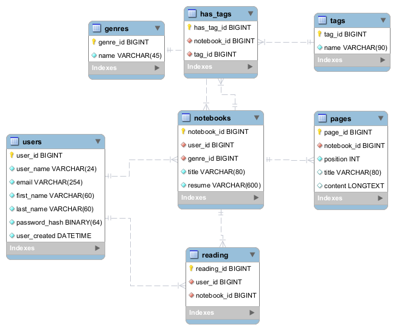

This focused publication documents the MySQL **InnoDB Group Replication** cluster used as the transactional backbone for SinPluma. It explains every part of the cluster, what the cluster achieves (guarantees and capabilities), how it is automated (bootstrap and provisioning), the failover and recovery strategy, and the overall architecture and operational considerations.

---

## 1. What the cluster is and what it achieves

The InnoDB Cluster (MySQL Group Replication + MySQL Router) is the canonical, ACID transactional layer for SinPluma. Its primary goals are:

- **High availability (HA):** tolerate node failure without losing the ability to serve transactional reads/writes.
- **Transactional consistency:** maintain ACID guarantees for critical entities (users, notebooks, pages, revisions).
- **Automatic failover / primary election:** if the primary fails, the cluster elects a new primary automatically so applications can continue to operate (subject to routing).
- **Simplified application connectivity:** MySQL Router presents a single logical endpoint for the application, removing the need for the app to manage multiple host addresses.
- **Durability & recoverability:** combined with persistent storage and backups, the cluster supports point-in-time recovery and physical/incremental backups.

In short: the cluster provides a resilient, strongly-consistent relational store suitable for editorial history and user state where correctness is more important than absolute write throughput.

---

## 2. Cluster components — detailed breakdown

### 2.1 MySQL Server instances (Group members)

- **Role:** run `mysqld` with Group Replication enabled. Each instance holds a copy of the dataset and participates in group consensus for replication.
- **Key configuration elements (examples present in the project):**
  - `gtid_mode = ON` and `enforce_gtid_consistency = ON` — ensures global transaction identifiers for deterministic replication.
  - `binlog_format = ROW` — required for Group Replication and precise data propagation.
  - `log_slave_updates = ON` — allows relay of group-applied transactions to replicas.
  - `transaction_write_set_extraction` enabled — used by the group replication mechanism for conflict detection.
  - Unique `server_id` and `report_host` per instance — required for proper group communication in container networks.
- **Persistence:** `/var/lib/mysql` is mounted to host directories or volumes so databases survive container restarts.

### 2.2 MySQL Router

- **Role:** lightweight proxy/routing layer that exposes logical endpoints for applications:
  - a single read-write endpoint (routes to the current primary)
  - one or more read-only endpoints (to route to replicas) if configured
- **Benefits:** Applications (Flask/SQLAlchemy) connect to `inno_router:6446` (example in SinPluma); Router performs topology-aware routing and hides cluster membership changes.

### 2.3 MySQL Shell scripting (automation helper)

- **Role:** the project uses `mysqlsh` and a Python script (`create_cluster.py`) to automate:
  - instance configuration (`dba.configureInstance(...)`)
  - cluster creation (`dba.createCluster(...)`)
  - adding instances (`cluster.addInstance(...)`)
  - cluster recovery and health checks
  - optional schema/bootstrap data loading (e.g., `sinpluma.sql`)
- **Why Shell:** MySQL Shell exposes the `dba` and `cluster` APIs that wrap the complex sequence of steps needed to reliably form a Group Replication cluster.

### 2.4 Backup tooling & operators (recommended / referenced)

- The project references physical backup best practices (e.g., Percona XtraBackup) for consistent snapshotting of InnoDB data and enabling PITR when combined with binary log archiving.

---

## 3. Cluster architecture & topology

A minimal production-like topology used in the project:

- **Three MySQL nodes** (recommended minimum for quorum)
  - Provide sufficient majority for failover decisions and avoid split-brain scenarios.
- **MySQL Router** deployed as a separate process/container
  - Presents a single write endpoint and optional read endpoints.
- **Applications** (Flask) connect to the Router; they do not connect directly to individual MySQL nodes.

**Topology considerations**

- The cluster commonly runs in **single-primary mode** (one writable primary, others members that replicate), which simplifies conflict semantics.
- Read scaling is achieved by configuring Router read-only endpoints to route read traffic to replicas.
- For geographically distributed deployments, be cautious: Group Replication assumes reasonably low-latency networks; cross-region latency impacts commit acknowledgement times.

---

## 4. Automation — how the cluster is provisioned and bootstrapped

SinPluma's repository provides deterministic automation intended for demo and local/CI environments. The automation covers instance configuration, cluster creation, Router setup and initial schema load.

### 4.1 Steps performed by automation (high level)

1. **Start MySQL server containers** with base CNF files mounted (one per node).
2. **Wait for MySQL to become available** (check TCP port and accept connections).
3. **Run MySQL Shell script (`create_cluster.py`)** which:
   - Calls `dba.configureInstance(instance)` to apply Group Replication runtime configuration and create necessary accounts.
   - Executes `dba.createCluster(clusterName, options)` if there is no existing cluster; this bootstraps the first primary.
   - Runs `cluster.addInstance()` for each subsequent node to join them to the group.
   - Optionally runs a SQL seed script (e.g., `sinpluma.sql`) once the cluster is healthy.
4. **Start MySQL Router** and write router config referencing the cluster.
5. **Application start**: apps connect to the Router's logical endpoint; the router performs discovery and proxies to the appropriate member.

### 4.2 Idempotency & recovery behavior

- The `create_cluster.py` script checks cluster status and can **recover** an existing cluster rather than blindly recreating it. This makes rerunning the automation tolerable and supports predictable recovery workflows.
- Automation enforces a deterministic ordering in Compose: servers → shell bootstrap → router → application.

### 4.3 Where automation lives

- **Docker Compose** orchestrates the lifecycle locally (perfect for demo/CI).
- **MySQL Shell** script is the core of DB automation (inside a helper container).
- For production, the same script logic maps well to Ansible or an operator-based approach (MySQL Operator for Kubernetes).

---

## 5. Failover, election and recovery strategy

### 5.1 Failover mechanics (how failover occurs)

- **Group Replication** maintains a group view and gossip-style membership. If the primary node fails or becomes unreachable, the remaining members detect the failure.
- **Primary election:** the group elects a new primary based on group view and configured failover policies (majority/quorum rules).
- **Router role:** MySQL Router updates its routing tables (or uses discovery) so the application's logical endpoint now points to the newly elected primary.

### 5.2 Ensuring a safe failover (quorum & split-brain avoidance)

- **Quorum requirement:** Group Replication uses majority decisions. If a majority can't be formed (network partition), the minority side will not accept writes — preventing split-brain.
- **Single-primary mode:** reduces conflict surface; replicas do not accept writes unless promoted.
- **Network partition handling:** if network partitions occur, only the partition with majority can progress; the minority waits for rejoining.

### 5.3 Application-level resilience

- **Router + client retry:** Application drivers should implement retry/backoff for transient connection errors. Using Router minimizes the need for host switching logic in application code.
- **Idempotency:** Where operations may be retried (e.g., due to transient DB failover), idempotency keys or safe retry semantics are recommended for application endpoints.
- **Transaction boundaries:** Short-lived transactions are preferred to reduce the window of failed commits during failover.

### 5.4 Recovery & rejoin

- **Automatic rejoin:** when a failed node comes back, Group Replication performs state transfer (incremental or full) to bring it back in sync.
- **State transfer methods:** Depending on gap size, the member may fetch missing transactions via the group and apply them, or require a more substantial recovery flow.
- **Operator interventions:** Some recovery cases (corrupt data, missing binary logs) may require manual steps (re-cloning, re-seeding).

---

## 6. Backups, PITR and schema migrations

### 6.1 Backups & PITR

- **Physical backups:** Use tools like `xtrabackup` (Percona) for consistent physical snapshots of InnoDB data while the cluster is online.
- **Binary log archival:** Archive binary logs so you can replay transactions after restoring a snapshot (enables Point-In-Time Recovery).
- **Recommended cadence:** periodic full backups + frequent incremental backups + binlog archiving.

### 6.2 Schema migrations

- **Safe schema changes:** follow expand-contract pattern for zero-downtime migrations (e.g., add nullable columns or new indexes concurrently, backfill, then switch).
- **Migration tooling:** manage migrations with a version-controlled tool (Flyway, Liquibase, Alembic) executed as part of CI/CD with pre-migration checks.

---

## 7. Monitoring, observability and operational controls

- **Metrics to collect:**
  - Group replication state (`group_replication_primary_member`, `group_replication_flow_control_paused`).
  - Replication lag and apply times.
  - InnoDB metrics: buffer pool usage, checkpoint age, dirty pages.
  - Binary log disk usage and retention.
- **Tools:**
  - MySQL Exporter (Prometheus) + Grafana dashboards.
  - `performance_schema` / `sys` schema for detailed diagnostics.
  - Alerts on replication state changes, disk pressure, high apply latency, or loss of majority.
- **Runbooks:** operators should have procedures for:
  - Safe node replacement
  - Emergency failover (if automatic election does not complete)
  - Restore from backup and re-seed cluster members

---

## 8. Operational tradeoffs & constraints

- **Operational complexity:** Group Replication + Router is more operationally involved than a single instance; however, it yields HA and stronger guarantees.
- **Performance considerations:** Synchronous replication semantics (or semi-sync behavior) mean write latencies reflect group commit times; keep transaction sizes small and tune flow control.
- **Network sensitivity:** Group Replication relies on low-latency, reliable networking — multi-region deployments need careful design.
- **Scaling model:** Best suited for read-mostly scaling (read replicas); for write-heavy workloads horizontal sharding or different architectures may be required.

---

## 9. Recommended hardening & next steps for production

- **Operator / managed DB:** consider MySQL Operator (Kubernetes) or managed MySQL for enterprise-grade lifecycle management.
- **Automated PITR pipelines:** centralize binlog collection and backup retention policies.
- **Prometheus + Grafana + Alerting:** build dashboards and set SLOs for replication health and availability.
- **Chaos testing:** regularly simulate node failures and network partitions to validate automation and runbooks.
- **Secure service-to-service:** use network-level controls and enforce least-privilege DB accounts; consider encrypting replication channels and data-at-rest.

---

## 10. Closing summary

The InnoDB Cluster in SinPluma is the project's central reliability mechanism: a scripted, reproducible Group Replication topology combined with MySQL Router gives the application transactional correctness, failover capability, and simplified connectivity. The repository's automation (MySQL Shell scripts, CNF templates, Router config and compose wiring) demonstrates practical operational capability — bootstrapping, seeding, and recovering a multi-node cluster in a repeatable manner. With complementary operational tooling (backups, monitoring, migration workflows) the cluster is a robust foundation for a writing platform where data integrity and availability are paramount.
