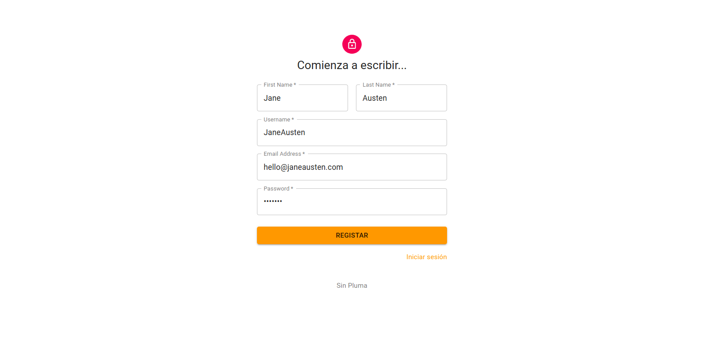

This focused publication documents exactly **how SinPluma uses JSON Web Tokens (JWTs)** for authentication and session management: why JWTs were chosen, the full lifecycle (request → issuance → client storage → request use → server validation → refresh → revocation), and how Redis-based blacklisting interacts with JWT statelessness. It closes with security notes and recommended best practices.



---

## 1. Why JWTs are used

SinPluma uses JWTs because they provide:

- **Compact, self-contained claims** (identity, roles, expiry) that services can verify without a DB round-trip.
- **Standardized, language-agnostic tokens** easy to generate/validate across microservices.
- **Decoupled authentication**: client holds proof of authentication and sends it with each request (no server session store required for basic validation).

In practice SinPluma uses two token types:

- **Access token (short-lived JWT)** — sent with each API request to prove identity and rights.
- **Refresh token (longer-lived JWT or opaque token)** — used only to obtain new access tokens without re-authenticating user credentials.

---

## 2. JWT structure (recap)

A standard JWT has three dot-separated parts:

```
HEADER.PAYLOAD.SIGNATURE
```

- **Header:** algorithm (e.g., `HS256`) and token type `JWT`.
- **Payload (claims):** `sub` (subject/user id), `exp` (expiry), `iat` (issued at), `jti` (unique token id), optional `roles` or `scopes`.
- **Signature:** HMAC or RSA signature over header+payload using server secret/private key.

Example claim set (conceptual):

```json
{
  "sub": "user:12345",
  "iss": "sinpluma.api",
  "aud": "sinpluma_clients",
  "iat": 1600000000,
  "exp": 1600003600,
  "jti": "c9f1a8b6-...",
  "roles": ["author"]
}
```

SinPluma includes a **JTI** (JWT ID) claim so tokens can be uniquely identified for revocation.

---

## 3. Full lifecycle — step by step

### 3.1 Authentication request (how a JWT is requested)

- **Client action:** User submits credentials (email/password) to:

```
POST /api/auth/login
Content-Type: application/json
{ "email": "...", "password": "..." }
```

- **Server checks:** validate credentials (bcrypt check), apply any rate limiting.
- **If valid:** server creates an access token and a refresh token and returns them in the response body (or sets cookie for refresh token).

Server response (conceptual):

```json
{
  "access_token": "<JWT.access>",
  "refresh_token": "<JWT.refresh>",
  "expires_in": 900
}
```

---

### 3.2 Token creation (on server)

- **Access token properties:**
  - Short TTL (e.g., 10–30 minutes).
  - Contains identity claims and minimal authorization claims (`roles`, `permissions`).
  - Signed using server secret (HS256) or private key (RS256).
  - `jti` included.

- **Refresh token properties:**
  - Longer TTL (e.g., days/weeks) or managed as opaque token.
  - Can be a JWT (with its own `jti`) or an opaque random token stored server-side.
  - If JWT refresh tokens are used, they also include `jti` for revocation tracking.

Token creation is typically done with a library such as `Flask-JWT-Extended`, which abstracts issuance and claim embedding.

---

### 3.3 How the client stores tokens

Common approaches and SinPluma considerations:

- **Access token — in memory or short-lived storage**
  - Preferred: store in memory (JS variable / Redux store) to minimize XSS exposure.
  - On page refresh it is lost, but the client can use the refresh token to obtain a new access token.

- **Refresh token — HttpOnly cookie (recommended)**
  - Best practice: store the refresh token in an **HttpOnly, Secure cookie** so JavaScript cannot read it (mitigates XSS).
  - Cookies can be protected with `SameSite` attributes to reduce CSRF risk.

- **Alternative (less secure) approaches**
  - Storing tokens in `localStorage` or non-HttpOnly cookies — not recommended for refresh tokens due to XSS risk.

The SinPluma demo environment may store tokens in local storage for simplicity, but production recommendations favor HttpOnly cookies for refresh tokens and short-lived in-memory access tokens.

---

### 3.4 How tokens are sent to the server

- **Access token:** included in each API request:

```
Authorization: Bearer <access_token>
```

Typically added automatically via an Axios interceptor.

- **Refresh flow:** when the access token expires, the client calls:

```
POST /api/auth/refresh
```

- If refresh token is in HttpOnly cookie, the request automatically includes it.
- If refresh token is returned to client JS, it is included in the POST body.

---

### 3.5 Server validation of incoming JWTs

When a request arrives with `Authorization: Bearer <jwt>`:

1. Parse token (split header.payload.signature).
2. Verify signature using secret or public key. If invalid → reject (401).
3. Validate standard claims:
   - `exp` (not expired)
   - `nbf` (not before)
   - `iss` / `aud` if configured
   - `iat` sanity checks
4. Check token replay / revocation:
   - Extract `jti`
   - Query Redis blacklist
   - If found → reject (401/403)
5. Authorize action:
   - Validate `roles`/`scopes` against endpoint requirements.

Signature validation is local and fast; Redis lookup adds minimal latency.

---

### 3.6 Refreshing tokens (refresh flow)

1. Client detects access token expiry (401 response or client timer).
2. Client calls `/api/auth/refresh`.
3. Server validates refresh token:
   - Signature
   - Expiry
   - Redis blacklist check
4. If valid:
   - Issue new access token
   - Issue new refresh token (recommended rotation)
   - Blacklist old refresh token JTI in Redis (with TTL)
5. Return new tokens to client.

Refresh-token rotation significantly reduces risk if a refresh token is compromised.

---

### 3.7 Logout and revocation

- Client calls:

```
POST /api/auth/logout
```

- Server:
  - Extracts `jti` from access token
  - Extracts `jti` from refresh token
  - Stores both in Redis blacklist with TTL equal to remaining lifetime

Example Redis entry:

```
SETEX jwt:blacklist:<jti> <remaining_seconds> "revoked"
```

Now even if the token has not expired, it is rejected.

---

## 4. Redis-based blacklist — mechanics & implications

### 4.1 How it works

On revocation:

```
SETEX jwt:blacklist:<jti> <remaining_seconds> "revoked"
```

On every authenticated request:

```
EXISTS jwt:blacklist:<jti>
```

If key exists → token rejected.

---

### 4.2 Why use Redis blacklist?

- Immediate revocation capability.
- Lightweight storage (only JTIs).
- Automatic expiration via TTL.
- Extremely fast lookup.

---

### 4.3 The statelessness tradeoff

JWTs are meant to be stateless — validation should not require server storage.

Redis blacklisting introduces state:

- **Pro:** immediate logout & compromise mitigation.
- **Con:** every request requires a Redis lookup.

SinPluma accepts this tradeoff because security and immediate revocation outweigh minimal performance cost.

---

### 4.4 Alternatives to JTI blacklisting

- Short-lived access tokens only + opaque refresh tokens stored server-side.
- OAuth-style token introspection endpoint.
- Session invalidation timestamp comparison (`iat` vs `last_invalidated_at`).
- Strict refresh rotation + very short access TTL.

---

## 5. Security considerations & best practices

- Store refresh tokens in **HttpOnly Secure cookies**.
- Keep access tokens short-lived (10–30 minutes).
- Rotate refresh tokens on each use.
- Prefer RS256 if multiple services validate tokens.
- Blacklist JTIs with TTL equal to remaining token lifetime.
- Protect refresh endpoint from CSRF (SameSite + CSRF token).
- Log authentication anomalies.
- Avoid placing sensitive data inside JWT payload.

---

## 6. Example flows (concise)

### Login

1. POST `/api/auth/login`
2. Server validates credentials.
3. Server creates access + refresh tokens.
4. Return tokens (or set refresh cookie).

### Access protected resource

1. Client sends `Authorization: Bearer <access_token>`
2. Server verifies signature → checks Redis → authorizes → returns data.

### Access token expired

1. Client calls `/api/auth/refresh`
2. Server validates refresh token
3. Server issues new access token (+ new refresh token if rotating)
4. Blacklists old refresh JTI

### Logout

1. Client calls `/api/auth/logout`
2. Server blacklists access + refresh JTIs in Redis

---

## 7. Closing summary

SinPluma uses JWTs to provide decentralized, standards-based authentication:

- Short-lived access tokens for per-request authorization.
- Longer-lived refresh tokens for session continuity.
- Redis-backed JTI blacklist for immediate revocation.

This approach balances performance (local signature validation) with security (revocation, rotation, short TTLs), making it suitable for a distributed microservices environment while maintaining strong authentication guarantees.
