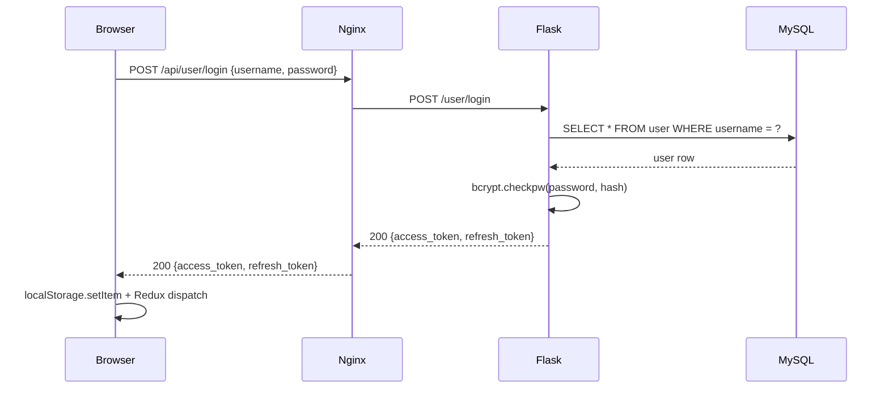
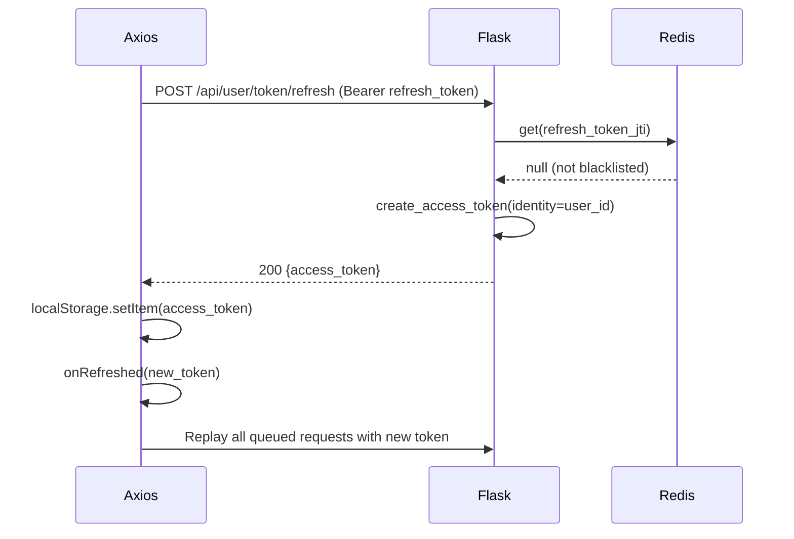

Pure JWT authentication has a well-known problem: you can't revoke a token before it expires. Once a user logs out on the client, the token is gone from their browser, but anyone who captured it earlier can keep using it for the rest of its lifetime. Sin Pluma addresses this by combining JWT with a Redis blacklist, getting most of the benefits of stateless auth while still supporting real logout semantics. This post traces the full lifecycle from login through token refresh to logout, and explains where the security trade-offs land.

---

## Why JWT

Sin Pluma uses JWTs for three specific reasons.

**Compact, self-contained claims.** Identity, roles, and expiry all live inside the token. Services can verify authenticity without a database round-trip on every request.

**Standardized and language-agnostic.** JWTs are easy to generate and validate across multiple services using well-audited libraries. The linguistics microservice and the main Flask API both understand the same token format.

**Decoupled authentication.** The client holds proof of authentication and sends it with each request. No server-side session store is required for basic validation.

---

## JWT structure

A standard JWT has three dot-separated parts: header, payload, and signature.

```
HEADER.PAYLOAD.SIGNATURE
```

The **header** contains the algorithm (`HS256` in Sin Pluma's case) and the token type.

The **payload** contains claims. Sin Pluma's access tokens include `sub` (the user ID), `exp` (expiry timestamp), `iat` (issued at), and `jti` (a unique token identifier used for revocation).

```json
{
  "sub": "user:12345",
  "iss": "sinpluma.api",
  "iat": 1600000000,
  "exp": 1600000900,
  "jti": "c9f1a8b6-4e2d-11ec-81d3-0242ac130003"
}
```

The **signature** is an HMAC over the header and payload using the server's `JWT_SECRET_KEY`. Tampering with any part of the token invalidates the signature.

The `jti` claim is the most important piece for revocation. Without a unique identifier on each token, there's no way to distinguish one token from another in the Redis blacklist.

---

## Token model

Sin Pluma uses two tokens per session, configured in `config/settings.py`.

```python
ACCESS_EXPIRES = timedelta(minutes=15)
REFRESH_EXPIRES = timedelta(days=30)

JWT_ACCESS_TOKEN_EXPIRES = ACCESS_EXPIRES
JWT_REFRESH_TOKEN_EXPIRES = REFRESH_EXPIRES
```

The **access token** is short-lived and proves identity on every API request. It expires after 15 minutes. Flask-JWT-Extended reads these values and signs tokens accordingly.

The **refresh token** is longer-lived and can only be used at one endpoint to get a new access token. It expires after 30 days. Sending it to any other endpoint returns 401.

The `JWT_SECRET_KEY` is loaded from an environment variable and never appears in source code.

---

## Login flow



The login resource fetches the user by username, verifies the password with bcrypt, and creates both tokens using Flask-JWT-Extended.

```python
class Login(Resource):
    def post(self):
        data = login_schema.load(request.json)
        user = User.query.filter_by(username=data['username']).first()
        if not user or not bcrypt.checkpw(data['password'].encode(), user.password.encode()):
            return {'message': 'Invalid credentials'}, 401

        access_token = create_access_token(identity=user.user_id)
        refresh_token = create_refresh_token(identity=user.user_id)
        return {'access_token': access_token, 'refresh_token': refresh_token}, 200
```

The frontend stores both tokens and calls `startSession()` from `Session.js`, which parses the access token to extract the user ID and username, then dispatches a Redux action to mark the session as authenticated.

---

## How tokens are sent to the server

Every outgoing API request includes the access token in the Authorization header.

```
Authorization: Bearer <access_token>
```

The Axios interceptor in `Api.js` adds this header automatically on every request. The server never sees a request to a protected endpoint without the Authorization header present.

For the refresh flow, the refresh token is sent to a single endpoint.

```
POST /api/user/token/refresh
Authorization: Bearer <refresh_token>
```

---

## Server validation on every request

When a request arrives with `Authorization: Bearer <jwt>`, Flask-JWT-Extended runs through a validation sequence.

1. Parse the token: split header, payload, and signature.
2. Verify the signature using the server secret. If invalid, return 401.
3. Validate standard claims: `exp` (not expired), `nbf` (not before if set), `iss` and `aud` if configured.
4. Extract the `jti` and query the Redis blacklist. If the key exists, return 401.
5. If all checks pass, call `get_jwt_identity()` to extract the user ID for the resource function.

```python
@jwt.token_in_blacklist_loader
def check_token_blacklist(decoded_token):
    jti = decoded_token['jti']
    return rc.get(jti) is not None
```

Signature validation is local and fast. The Redis lookup adds one network round-trip per protected request. This is the cost of supporting real revocation.

---

## Token refresh flow



The refresh endpoint requires the refresh token via `@jwt_refresh_token_required`.

```python
class TokenRefresh(Resource):
    @jwt_refresh_token_required
    def post(self):
        current_user = get_jwt_identity()
        new_access_token = create_access_token(identity=current_user)
        return {'access_token': new_access_token}, 200
```

The subscriber queue pattern in `Api.js` ensures that when multiple requests fail simultaneously because the access token expired, only one refresh attempt runs. All other failed requests queue themselves and replay once the new token is available. The user never sees a session interruption.

---

## Logout and the Redis blacklist

Logout stores the access token's JTI in Redis with a TTL slightly longer than the token's natural expiry.

```python
class Logout(Resource):
    @jwt_required
    def delete(self):
        jti = get_raw_jwt()['jti']
        rc.set(jti, jti, ex=int(ACCESS_EXPIRES.total_seconds() * 1.2))
        return {'message': 'Successfully logged out'}, 200
```

The Redis key is set with this pattern.

```
SETEX jwt:blacklist:<jti> <remaining_seconds> "revoked"
```

The TTL is `ACCESS_EXPIRES * 1.2`, which gives 18 minutes for a 15-minute token. The extra 20% accounts for clock drift between services. Once the token would have expired naturally, Redis deletes the key automatically. The blacklist never needs manual cleanup and stays bounded in size.

On every subsequent request with that JTI, the `token_in_blacklist_loader` finds the Redis key and returns True, causing Flask-JWT-Extended to reject the request with 401.

---

## Why Redis for the blacklist

Redis fits this use case precisely because of three properties.

**Immediate revocation capability.** The blacklist entry exists as soon as `SET` returns. There's no replication lag, no eventual consistency window.

**Automatic expiration via TTL.** Redis cleans up entries without application code doing anything. The blacklist is self-maintaining.

**Extremely fast lookup.** A single `GET` command on a key is O(1). Even under load, the Redis lookup adds negligible latency compared to the database query that follows.

The cost is that pure JWT statelessness is gone. Every protected request requires a Redis round-trip. Sin Pluma accepts this tradeoff because security and immediate revocation outweigh minimal performance cost for a platform handling editorial content.

---

## Refresh token revocation gap

The current implementation blacklists access tokens on logout but not refresh tokens. A captured refresh token remains usable for up to 30 days to generate new access tokens with fresh JTIs, bypassing the logout blacklist entry.

Fixing this requires blacklisting the refresh token JTI on logout as well.

```python
# Complete logout (recommended improvement)
access_jti = get_raw_jwt()['jti']
rc.set(access_jti, access_jti, ex=int(ACCESS_EXPIRES.total_seconds() * 1.2))
# Also blacklist the refresh token
refresh_jti = request.json.get('refresh_jti')
rc.set(refresh_jti, refresh_jti, ex=int(REFRESH_EXPIRES.total_seconds() * 1.2))
```

The outline documentation for this project describes refresh-token rotation as the stronger defense: issue a new refresh token on every refresh call and blacklist the old one. If a captured refresh token is used, the legitimate user's next refresh will fail because their current token has been rotated away, creating a detectable anomaly.

This gap is acceptable for the current scope because refresh tokens only travel to one endpoint from client code that controls `localStorage`. Capturing a refresh token requires XSS access or physical device access, at which point the security model has other, more serious problems.

---

## Token storage trade-offs

Sin Pluma stores both tokens in `localStorage` for simplicity. This is a common choice with a common criticism: XSS vulnerabilities can exfiltrate tokens from `localStorage`.

The production recommendation from the project outlines is different. Store the access token in memory (a JavaScript variable in Redux state or a closure) where XSS cannot directly read it. Store the refresh token in an `httpOnly`, `Secure` cookie with `SameSite` attributes, so JavaScript cannot access it but the browser sends it automatically to the refresh endpoint.

```
Set-Cookie: refresh_token=<value>; HttpOnly; Secure; SameSite=Strict
```

This approach limits what an XSS attack can exfiltrate while preserving the refresh mechanism. The access token in memory is lost on page refresh, but the browser sends the cookie to `/token/refresh` automatically and gets a new one.

For a platform handling creative writing rather than financial transactions, the `localStorage` approach is an acceptable simplification. For a higher-stakes application, the cookie-based approach is the right default.

---

## Security checklist

The full set of security controls and recommendations from this implementation.

- Passwords use bcrypt hashing. Plaintext passwords never touch the database.
- Access tokens are short-lived at 15 minutes. The window of exposure on token theft is narrow.
- JWT secret key is loaded from an environment variable and never appears in source code.
- Redis blacklist provides immediate revocation on logout.
- Marshmallow schemas validate all inputs before they reach business logic.
- File uploads validate MIME type and size server-side, not just client-side.
- For production: store refresh tokens in `httpOnly` cookies, rotate on every use, and blacklist old JTIs.
- For production: prefer RS256 over HS256 if multiple services validate tokens independently, so the private key never needs to be shared.
- Log authentication anomalies: repeated 401s, unusual refresh patterns, and token reuse after logout.
- Avoid placing sensitive data inside JWT payloads. They're base64-encoded, not encrypted. Anyone with the token can read the claims.

---

## Full lifecycle summary

The complete token lifecycle in one place. Login creates both tokens and stores them client-side. Every API request sends the access token as a Bearer header. Flask-JWT-Extended decodes it, validates the signature, checks the Redis blacklist, and either proceeds or returns 401. When the access token expires, the Axios interceptor exchanges the refresh token for a new access token and replays any queued requests. Logout stores the access token's JTI in Redis with an 18-minute TTL so the server rejects any subsequent use of that token.

The design gives 15-minute token rotation, real logout semantics, and transparent refresh. The cost is one Redis round-trip per protected request, which is negligible alongside the database query that follows.
