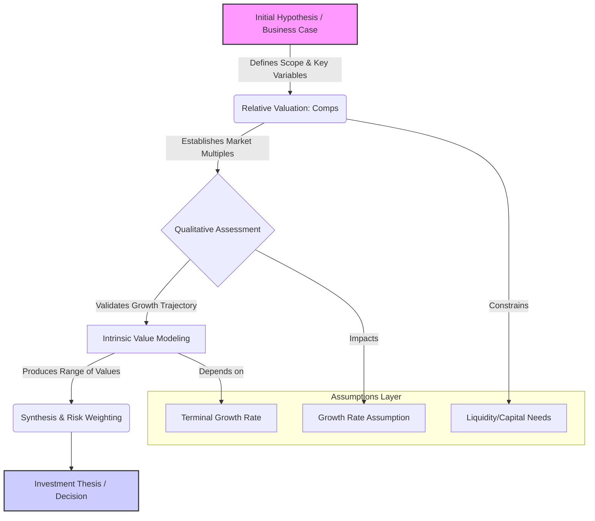
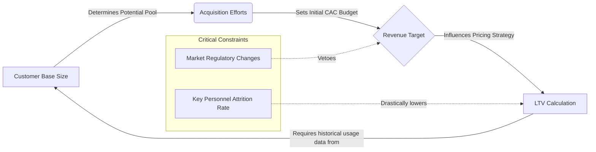

import Callout from "@components/ui/display/Callout.astro";
import ChatBubble from "@components/ui/display/ChatBubble.astro";
import List from "@components/ui/display/List.astro";
import MockupBrowser from "@components/ui/display/MockupBrowser.astro";
import MockupPhone from "@components/ui/display/MockupPhone.astro";
import MockupWindow from "@components/ui/display/MockupWindow.astro";
import Steps from "@components/ui/display/Steps.astro";

When you first open a complex financial model, the sheer density of ratios and colored cells can feel overwhelming; most people end up picking one metric, like P/E or DCF, and treating it as gospel truth. This approach wrongly assumes all models measure the exact same thing under identical conditions. I spent considerable time wrestling with a valuation recently that showed wildly divergent outputs across different modeling techniques. What I learned wasn't what the correct price was, but how to build a framework that forces me to articulate why one model's assumptions couldn't possibly apply to another's.

---

## The Pitfall of Single-Metric Analysis

The biggest trap in technical analysis isn't reading too little data; it’s trusting too much data from just one source or methodology. Developers train themselves to assume that if the input looks clean, the output *must* be correct. Finance operates under a similar fallacy by presenting models with pristine inputs and expecting flawless conclusions every time. A P/E ratio tells you nothing about supply chain capacity, while a Discounted Cash Flow model makes sweeping assumptions about perpetual growth rates far into the future.

These methods aren't comparable benchmarks; they act more like lenses focused on different aspects of a business’s potential. Thinking one is superior to another feels like asking which programming language performs better overall—it depends entirely on whether you plan to build a web backend, an embedded system, or a mobile UI. You need to understand the scope and assumptions behind each tool before drawing any hard conclusions for your project design.

> The tension between calculated economic reality and perceived market value is where the real insight lies for any technical reader to grasp fully. A healthy investment thesis must acknowledge which assumption set currently dominates your analysis and why that dominance should be viewed with extreme skepticism regarding its long-term validity.

<Callout variant="warning" title="The Fallacy of Clean Inputs">
  In engineering, we test against edge cases; in finance, we often assume steady-state operations. The gap between the two is where most flawed analyses reside. Always ask which assumption set provides the necessary boundary conditions for your desired outcome before proceeding further.
</Callout>

---

## Architecting the Framework: Multi-Model Construction Process

The goal shifts entirely from finding "the answer" to architecting the decision process itself. A robust valuation framework, therefore, isn't a single calculation; it represents an assembly line of complementary models designed specifically to stress-test core assumptions against different analytical lenses. We must treat each model not as a final conclusion but rather as a required variable in a larger equation demanding validation across its inputs.

The basic flow involves mapping the known unknowns across three primary analytical dimensions: relative valuation using comparables, intrinsic value via DCF/multiples, and qualitative market assessment. Understanding how these methodologies hand off information is crucial for building any real trust into your final conclusion about the business unit's trajectory.

To better illustrate this required process, we map out the conceptual structure using a flow diagram because the explicit handoffs between methodologies are critical to understanding the overall risk profile of the business.



This diagram shows the necessary inputs feeding into your final synthesized thesis. Notice how the qualitative assessment (C) doesn't just *inform* the next step; it directly constrains the growth rates assumed within the DCF model (D). That inherent interdependency is where most casual analysis fails, creating blind spots that a purely formulaic approach will miss entirely over time.

<Callout variant="information" title="The Synthesis Point">
  The transition from Model Output to Thesis requires human judgment—the ability to state, "This model breaks here because the underlying assumption is flawed." This skill separates technical analysts from true financial architects in practice.
</Callout>

---

## Data Preparation and Assumption Mapping: The Necessary Pre-Modeling Phase

Before any calculation can begin, you must dedicate significant time defining the data inputs and explicitly mapping every core assumption. I recall a project where we jumped straight into building a complex growth model based on quarterly revenue reports; the results were immediately suspect because one crucial piece of preparatory work was skipped entirely. We had clean numbers but zero understanding of how those numbers were generated or what variables they implicitly relied upon in their source system.

This initial data mapping phase involves more than just cleaning null values from a spreadsheet. You must interrogate the *process* that created the data points. For instance, if you are using customer churn rates, you need to verify whether the rate provided accounts for customers who left due to external market shifts or those who simply waited until a competitor launched a better feature.

We need a structured way holding these required inputs before they touch any formula. Consider mapping out every key driver in a dedicated section, detailing its source system and the specific normalization rules applied to prepare it for modeling use. This forces you to create an auditable trail justifying your model's starting point.

### Understanding Variable Interdependence

The variables rarely act alone; they form complex dependencies across time and business units. If analyzing a SaaS product, the required Customer Acquisition Cost (CAC) variable doesn't operate in isolation. It must relate back to the expected Customer Lifetime Value (LTV), which itself is governed by retention rates derived from historical usage data.

To visualize this mandatory dependency structure, we can use a system graph representation showing how each foundational metric constrains every subsequent calculation. This moves you past simple sequential steps into understanding a true interconnected system.



This diagram highlights that external forces, like regulatory changes (E), can veto the entire revenue target (C) regardless of how strong the initial customer base appears. The technical thinking must revolve around identifying these points of failure before writing a single `IF` statement in your model code.

---

## Modelling Techniques: Choosing the Right Lens

When tackling valuation, you will encounter at least three distinct analytical paradigms: relative comparables (Comps), intrinsic value modeling like DCF, and qualitative assessment. Treating them as interchangeable tools causes flawed analysis because they answer fundamentally different business questions. You must select your lens based on what aspect of risk or opportunity you want to stress test for the stakeholders reviewing the report.

The comparison between Comps and DCF is perhaps the most instructive example of this methodological gap. The comps approach asks, "What do successful peers who operate in a similar market segment suggest we are worth *right now*?" It anchors your thinking to current market sentiment and observable transaction multiples. Conversely, the DCF methodology forces you into an exercise of pure operational forecasting—it demands that you build a narrative about how the company will manage its own inputs flawlessly over decades.

This difference in scope means relying too heavily on comps might cause you to ignore necessary structural changes, while depending only on DCF can make your projections seem detached from market reality or peer performance standards. The goal is synthesis.


---

## The Final Layer: Risk Weighting and Synthesis Methodology

After running DCF, Comps, and any other relevant model like Sum-of-the-Parts, you are left with a range of values, not a single definitive number to present. This realization is the most important conceptual leap for technical readers mastering; your job fundamentally shifts from calculation toward pure **judgment**. The synthesis phase requires mapping external, non-quantifiable factors onto your model outputs to build a complete picture of risk accounting for systemic failure points beyond the math itself.

The process demands that you assign weights based on the reliability and scope of the input data across all models. If the current liquidity ratio falls below one, that signals an immediate cash flow risk that any standard DCF model failed to capture because it inherently assumes steady access to capital reserves over time for operations. This gap in quantitative modeling represents a critical failure point for the entire thesis construction process.

To structure this final weight assignment rigorously, we need a clear sequence of checks forcing methodological rigor upon the conclusion. Below illustrates how we weigh these disparate signals into one coherent conclusion that can withstand deep scrutiny from an expert reviewer.

```mermaid
graph LR
    A[DCF Output] -->|Weight 40%| E(Final Value Estimate);
    B[Comps Output] -->|Weight 35%| E;
    C[Liquidity/Risk Signal] -->|Hard Constraint (Pass/Fail)| E;

subgraph Weighting Logic
    E -- If C is Fail --> Z{Valuation Suspended};
end
```

In this simplified representation, the **Hard Constraint** from liquidity acts as a definitive veto power over the entire estimate. If that constraint fails, the entire valuation collapses, regardless of how strong or supportive the DCF or Comps suggested otherwise by their numbers alone. By viewing financial analysis not as solving for an equation, but rather as validating a multi-stage architectural build process, you shift from being a mere consumer of ratios to becoming a true architect of your own investment thesis and risk profile within the business unit framework.
