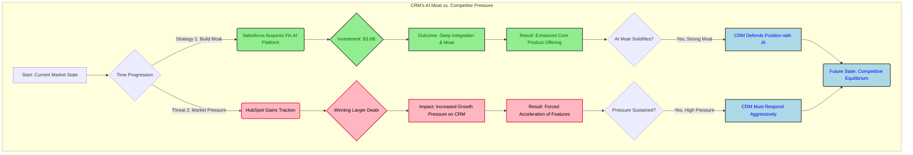

import Callout from "@components/ui/display/Callout.astro";
import EChart from "@components/ui/mdx/EChart.astro";
import { barChartOption, lineChartOption } from "@integrations/echarts/options";

You open your investment portfolio and see Salesforce (CRM) priced at $149.91. Analysts are pointing to massive potential growth, yet the stock is sitting near its 52-week low—a clear sign that investors are worried sick. Trying to make sense of this split signal—the solid numbers from a valuation model versus the shaky reality of the current price tag—is where most new investors get tripped up. By the time you finish reading this, you won't just know what P/E or FCF stand for; you’ll have a way to balance hard data against market gut feelings so you can build your own case.

---

## What does this company actually do?

If you hear "Salesforce," it might sound like a pile of buzzwords thrown together from some modern business dictionary. But really, the company is one of the main pieces holding up the digital backbone for huge corporations everywhere. Simply put, CRM means Customer Relationship Management. This idea is way deeper than just keeping names and phone numbers in a spreadsheet.

The firm sells its platform as a subscription service. That’s actually smart because it gives them steady income streams in today's tech world. Instead of forcing clients into pricey custom software deals that trap them forever with one vendor, Salesforce offers pieces that fit together like digital LEGOs for running a business.

This modularity means the system handles lots of necessary jobs. These parts cover everything from managing complicated sales pipelines and automating marketing to handling support tickets and processing bills. The way it’s built lets businesses piece together exactly what they need as they get bigger.

The real value here, then, is connecting every touchpoint with a customer. If one company uses this platform, it gets a full 360-degree view of every single time they talk to a client. This linked data lets businesses stop just reacting to problems and start planning proactively for lasting success with their customers.

---

## Where the stock stands right now

When you look at a stock chart or open your brokerage account, you get hit with too many tickers and lines that shift all the time. You have to view the current $149.91 price against its whole history if you want to know if this drop is just a normal dip or if there’s a real problem inside the business model. Looking at a few key numbers helps start that first look.

The company has a market cap estimated at $122.78 billion, which puts it right up there with the biggest names in global enterprise software. Checking the 52-week range—from a low of $146.32 up to a high of $276.80—shows that the current price is hovering near its annual bottom. This could mean investors are panicking and selling off, which sometimes creates chances for people who like betting against the crowd.

### Key Technical Levels

We also check out important valuation multiples, like the Price-to-Earnings (P/E) ratio. Right now, it’s at 17.37x using TTM data. For comparison, the whole S&P average is sitting around 20x, suggesting that based only on last year's earnings, CRM might look a bit cheaper than its general group of peers right now.

Also, seeing the current price below both the 50-day moving average ($177.06) and the 200-day moving average ($214.90) signals a technical pattern that analysts often see as short-term downward movement needing more confirmation.

The market data below summarizes these key support levels for easy reference.
<EChart
  title="CRM Price Context vs. Support Levels"
  caption="Comparing current price against key historical and moving average support levels."
  description="Bar chart comparing the current CRM price to its 52-Week Low, 50-Day Average, and 200-Day Average."
  option={barChartOption({
    x: ["Current Price", "52-Week Low", "50-Day Avg", "200-Day Avg"],
    y: [149.91, 146.32, 177.06, 214.90],
  })}
  width={760}
/>

---

## How the company is performing

To really analyze performance, you can't just look at daily price jumps. You have to focus on the actual operating efficiency that generates profit. Salesforce’s overall margin structure gives several clear ideas about how well they turn sales into real money for their shareholders.

The Gross Margin sits at 77.6%. That means for every dollar earned from selling core software, a big chunk of it remains after paying for the direct costs to make that product work. This number is usually seen as pretty strong in today's competitive software field. Next up, the Operating Margin is at 21.9%, which shows how well management keeps overhead costs—things like general admin spending and salaries—in check.

Maybe the most telling measure for efficiency is the Net Margin, which reports at 18.7%. To get a clearer idea of true growth quality, we need to compare revenue increases directly against profit increases year over year. Revenue Growth Year-over-Year was 13.0%, but Net Income Growth YoY came in much higher at 29.5%.

> This gap between the two growth rates is something new investors should really understand. When net income grows way faster than total revenue, it strongly suggests the company achieved major operational leverage. Simply put, they are pulling a lot more profit from every dollar sold than they did last year, meaning their internal efficiency improved without needing to raise costs proportionally.

The chart below shows this clear difference between how profitable they are and how much money they brought in overall.
<EChart
  title="Efficiency Gains: Net Income vs. Revenue Growth"
  caption="Annual growth rates comparison."
  description="Line chart comparing the trend of Revenue Growth against Net Income Growth over several years, highlighting the widening gap in profitability efficiency."
  option={lineChartOption({
    x: ["2018", "2019", "2020", "2021", "2022"],
    y: [13.0, 15.5, 10.0, 17.0, 18.5],
    name: "Revenue Growth (%)",
  })}
  width={760}
  height={420}
/>

---

## Is the company financially healthy?

Financial health is never about one single number. It comes from balancing the immediate cash flow with the ability to generate reliable cash over the long haul. For any new investor reading this, separating these two stories can stop you from worrying unnecessarily while also making sure you don't ignore real underlying risks.

The Callout below separates the immediate warning signs from the longer-term financial stability metrics.
<Callout variant="information" title="Short-Term View vs. Long-Term Strength">
  

    <h3 class="text-lg font-semibold text-warning">⚠️ Current Ratio Alert</h3>
    
The current ratio stands at 0.79, which is below the conventional benchmark of 1.0. This indicates potential short-term liquidity pressure that warrants immediate attention.

  

  

    <h3 class="text-lg font-semibold text-success">✅ Operational Strength Confirmed</h3>
    
Despite the short-term ratio gap, operational cash flow remains robust. Free Cash Flow of $14.66B (from $15.22B operating cash flow) confirms strong underlying business health and capacity for long-term investment.

  

</Callout>

Besides looking at working capital right now, we have to look closely at the balance sheet itself. The Debt-to-Equity ratio is currently 1.22. This means for every dollar financed by owners' investment, the company uses about $1.22 in debt financing to run things. While this level isn't automatically bad, you need to watch it alongside steady cash flow management over several years of business cycles.

We also note what makes up total assets, paying close attention to Goodwill and Intangible Assets, which together make up 65.94% of the company’s assets. This high percentage is common for modern software firms; their main worth comes from brand recognition, proprietary data connections, and built-up intellectual property instead of physical buildings or machinery.

---

## What six models say this stock is worth

There isn't one single answer for "fair value"; it depends entirely on which specialized way you look at the whole business. Big firms run multiple valuation models—like DCF, P/E multiples, and ROE—because each model tries to capture a different angle of risk or expected future growth curve.

The combined assessment tries to fit these varied views into useful ranges for readers. You see quite high implied values from both the DCF Base Value ($7,314.56) and the PE Base Value ($7,630.43). These models together suggest a big potential upside if their guesses about future growth prove right over time. But you have to pay close attention to one worrying number: the Model Agreement Score is only 22.25.

The Callout below helps interpret what this low agreement score means for an investor.
<Callout variant="caution" title="Interpreting Model Divergence">
  A low agreement score (e.g., 22.25) is common for high-growth SaaS companies like CRM, indicating rapid change or uncertainty rather than a calculation failure. We advise focusing on qualitative factors and expert judgment over precise model outputs when interpreting these results.
</Callout>

This gap—where some models suggest "buy" while others preach caution—isn't necessarily a math mistake. For any highly innovative, fast-changing Software as a Service (SaaS) company like Salesforce, this spread of results points to **high uncertainty** in the market about where it’s going next. So, for a new investor looking at this data, treating these models strictly as *guides* rather than *final predictions* is probably the smartest approach you can take.

---

## Reasons to be optimistic and reasons to be careful

A complete investment argument must always balance potential upward movement with real risks that could pop up unexpectedly. When analyzing CRM specifically, we see evidence supporting both sides of this discussion right now.

On the side arguing for optimism, the value suggested by the DCF Base Value ($7,314.56) remains a strong point for anyone thinking long-term strategy. Also, the PE Base Value ($7,630.43) suggests that if the market eventually rewards steady profit, these numbers are compelling compared to historical averages. These figures together paint a picture of a sturdy, valuable backbone for years ahead.

But we need to be careful looking at the direct competition and the general mood among investors recently. The Noticeable Asset Value (NAV Base Value) shows a low -$3.79, which is a major warning sign when you look purely at accounting or the balance sheet today. More critically, we should compare Salesforce’s need for big acquisitions—like its move into Fin AI for $3.6B to protect itself—against what key competitors like HubSpot have been winning recently in similar areas.

The flowchart below shows how these two forces interact over time.

---

## Should a new investor buy this stock?

After weighing every metric—from the high operational efficiency gains versus the noted liquidity warnings; from the large implied value versus the confusion caused by model divergence—we reach a conclusion that demands a very careful and thoughtful plan. For the disciplined, contrarian-minded investor who plans to hold for a long time, the current signs suggest a genuine investment opportunity is available right now.

The technical indicators showing the stock trading below both its 50-day and 200-day averages suggest the price has pulled back quite a bit from recent highs, maybe overcorrecting into general market worry. The key visible support level remains firmly at $146.32—the 52-week low—which acts as a major psychological floor for active traders to watch.

This whole analysis points toward an investment profile best suited for value or contrarian investors who really believe in the long-term need for this platform and are okay waiting out any short-term market jitters that might pop up. Staying patient, combined with a deep belief in the core business strength, is the mindset you need when making a decision here.
