I built these three projects at different times, for different reasons. The valuation engine came first, then the investment analysis tool, then the publishing pipeline. They all work on their own, but they get more useful when they run in order. Start with a ticker and the last tool hands you an article ready to publish, with no section written by hand.

That connection was not planned from day one. It came from a practical habit I kept repeating. Read a concrete artifact, do the local work, and write something the next tool can understand.

```daisyui
{
  "component": "callout",
  "variant": "information",
  "ariaLabel": "Worked example",
  "content": [
    { "type": "paragraph", "text": "This chain has already produced a real publication on this site. Is Oracle Stock Undervalued? came from running these three tools in sequence." },
    { "type": "link", "href": "/thejournal/is-oracle-stock-undervalued/", "label": "Read the worked example", "external": false }
  ]
}
```

---

## The whole chain at a glance

The tools pass files forward instead of sharing state. The valuation engine produces the numbers, Equilyze turns those numbers into analysis, and Pressroom uses the analysis as source material for the final article.

```mermaid
flowchart LR
    Ticker(["🧑 Ticker"]) --> EVE["🧮 Equity Valuation Engine<br/>deterministic valuation"]
    EVE --> EVEout["📊 valuation JSON"]
    EVEout --> Equilyze["🤖 Equilyze<br/>LangChain agents"]
    Equilyze --> Artifacts["🗂️ report.md +<br/>valuation · analysis · news JSON"]
    Artifacts --> Pressroom["🖨️ Pressroom<br/>9-agent LangGraph pipeline"]
    Pressroom --> Publication(["📄 Published article"])

    classDef input fill:#FFE4B5,stroke:#333,stroke-width:2px,color:#000
    classDef engine fill:#90EE90,stroke:#333,stroke-width:2px,color:#064E3B
    classDef agent fill:#C7E9FF,stroke:#333,stroke-width:2px,color:#0F172A
    classDef press fill:#E6E6FA,stroke:#333,stroke-width:2px,color:#1E3A8A
    classDef data fill:#FFF3C4,stroke:#333,stroke-width:2px,color:#000
    classDef output fill:#87CEEB,stroke:#333,stroke-width:2px,color:#0F172A

    class Ticker input
    class EVE engine
    class Equilyze agent
    class Pressroom press
    class EVEout,Artifacts data
    class Publication output
```



---

## Three jobs, cleanly separated

The chain works because the tools stay in their lanes. The valuation engine does not try to write prose. Equilyze does not invent numbers. Pressroom does not rerun the valuation.

```daisyui
{
  "component": "list",
  "ariaLabel": "The three layers of the pipeline",
  "class": "my-8 shadow-sm",
  "items": [
    {
      "title": "Equity Valuation Engine",
      "subtitle": "The numbers, deterministic and testable",
      "description": "Turns one ticker into six valuation models across Bear, Base, and Bull scenarios, plus a composite value and a model-agreement score. No language model touches this layer.",
      "media": { "kind": "marker", "label": "1" },
      "status": { "label": "Deterministic", "color": "success" },
      "action": { "label": "Project", "href": "/projects/equity-valuation-engine/", "external": false }
    },
    {
      "title": "Equilyze",
      "subtitle": "The analysis, agents on top of the numbers",
      "description": "Wraps the engine, then runs a chain of LangChain agents that add market context, research the news, and combine the material into a recommendation with strengths, risks, and catalysts.",
      "media": { "kind": "marker", "label": "2" },
      "status": { "label": "Agentic", "color": "info" },
      "action": { "label": "Project", "href": "/projects/equilyze/", "external": false }
    },
    {
      "title": "Pressroom",
      "subtitle": "The story, handled by an editorial pipeline",
      "description": "Takes the analysis and its artifacts as source material and runs a nine-agent LangGraph pipeline that outlines, drafts, fact-checks, renders charts, and publishes a finished article.",
      "media": { "kind": "marker", "label": "3" },
      "status": { "label": "Editorial", "color": "warning" },
      "action": { "label": "Project", "href": "/projects/pressroom/", "external": false }
    }
  ]
}
```

### Layer one sets the anchor

The [Equity Valuation Engine](/projects/equity-valuation-engine/) is deliberately the dullest part of the chain. It does math, not judgement. Given a ticker, it normalizes the financial data, decides which valuation models fit the business, and runs the qualifying models across three scenarios. The output is a compact JSON document with every metric, each model's intrinsic value, the composite, and the agreement score.

Because this layer is deterministic, the same inputs produce the same numbers every time. The agents can argue, summarize, and write, but the valuation stays fixed underneath them.

### Layer two turns numbers into an argument

[Equilyze](/projects/equilyze/) invokes the engine and then interprets the result. A sequence of LangChain agents pulls analyst ratings and momentum, researches recent news, and turns the material into a recommendation. After the first draft, a "curious investor" agent raises follow-up questions, section writers answer them, and a final reviewer reads everything back from disk before signing off.

Equilyze does more than print prose. It writes `report.md` plus the structured files behind it: `valuation_data.json`, `analysis.json`, and `news_data.json`. Those files are what make the next handoff possible.

### Layer three turns the argument into a publication

[Pressroom](/projects/pressroom/) is a nine-agent LangGraph editorial pipeline. Drop a folder of source material into its `input/` directory and it outlines the piece, drafts it, checks it in a bounded reviewer loop, strips AI patterns, designs the frontmatter, renders charts and diagrams deterministically, and writes a finished `.mdx` file.

For this chain, that folder is exactly what Equilyze produced. Pressroom reads the report and its JSON artifacts and writes the article you can read on this site.

---

## The contract is data, not code

There is no shared library gluing these three together, and no service calls another over the wire. The boundaries are files.

The handoff stays simple. The engine writes JSON, Equilyze adds a Markdown report and more JSON, and Pressroom receives a folder of source material. Each boundary is plain and inspectable, so any stage can be run, tested, or replaced on its own. A person can also open the files and see exactly what passed from one tool to the next.

```daisyui
{
  "component": "callout",
  "variant": "note",
  "ariaLabel": "Why the artifacts matter",
  "content": [
    { "type": "paragraph", "text": "Structured artifacts keep the final article grounded. The valuation figures and charts in the published piece are the exact numbers the engine computed. Pressroom checks the draft against the JSON instead of inventing values." }
  ]
}
```

---

## The full run

From a single ticker to a published article, the pipeline follows the same basic path every time.

```daisyui
{
  "component": "steps",
  "ariaLabel": "Pipeline stages",
  "activeColor": "success",
  "items": [
    { "label": "Ticker", "marker": "1" },
    { "label": "Value", "marker": "2" },
    { "label": "Analyze", "marker": "3" },
    { "label": "Artifacts", "marker": "4" },
    { "label": "Write", "marker": "5" },
    { "label": "Publish", "marker": "6" }
  ]
}
```

The engine handles the first two steps, Equilyze handles the middle, and Pressroom handles the writing and publication work. Everything runs locally against an [Ollama](https://ollama.com) model, so valuation, analysis, and publishing work offline with no cloud API keys.

---

## Why three tools instead of one

I could have written this as a single program. Keeping it as three has paid off in ways a monolith would not.

The separate tools still earn their keep outside this pipeline. I can use the engine when I only want a valuation, use Equilyze when I want a research pass, or point Pressroom at an article brief that has nothing to do with finance. The split also makes testing cleaner, because the deterministic core never mixes with the agentic and editorial layers.

They are easier to replace, too. Swap the model behind Equilyze, or point Pressroom at a different brief, and the file contracts still hold. That is the part I like most about the design. The published piece can change tone, structure, and framing without losing the numbers that started it.
